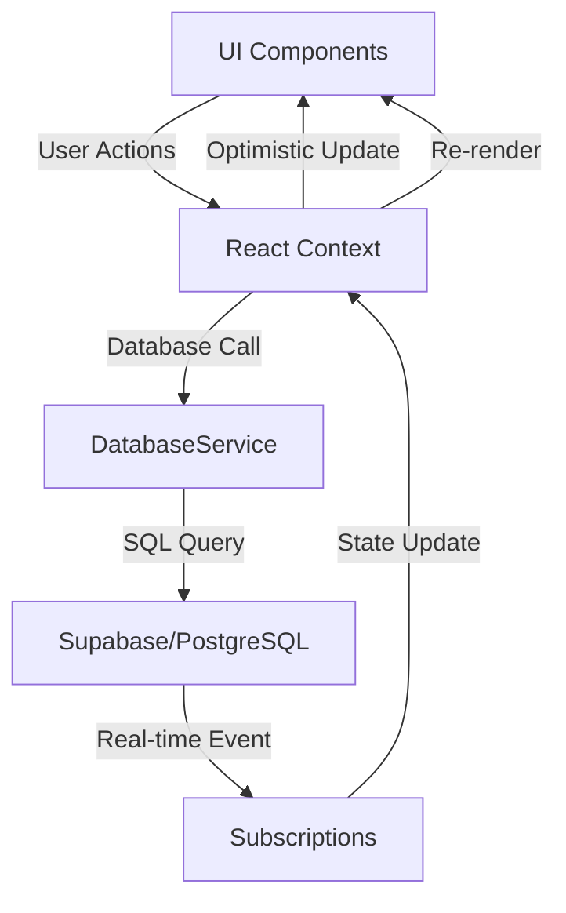
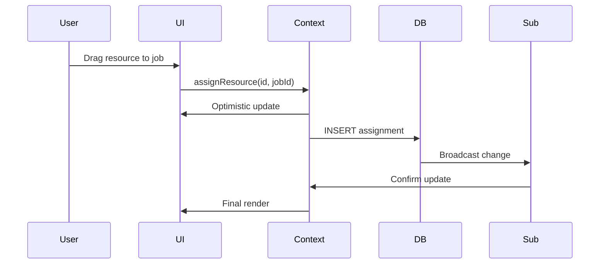
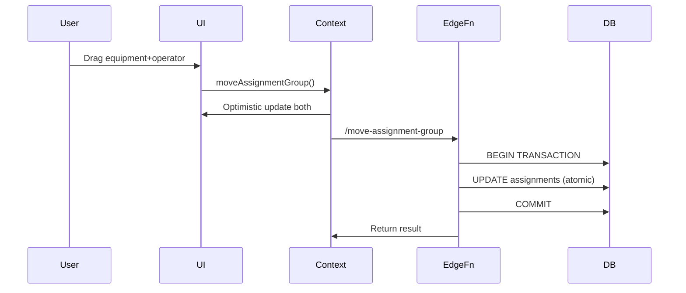
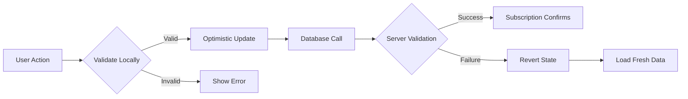

# Data Flow Architecture

## Quick Answer
BoardOS uses a unidirectional data flow with optimistic updates, real-time subscriptions, and local state management through React Context. Database operations flow through a centralized service layer with immediate UI updates and eventual consistency.

## Data Flow Overview



## Core Data Flow Patterns

### 1. Optimistic Update Pattern

```typescript
// Pattern: Update UI immediately, then sync with database
const assignResource = async (resourceId: string, jobId: string) => {
  // Step 1: Optimistic UI update
  setAssignments(prev => [...prev, optimisticAssignment]);
  
  try {
    // Step 2: Database operation
    const result = await DatabaseService.assignResource(resourceId, jobId);
    
    // Step 3: Real-time subscription confirms update
    // (handled automatically via subscription)
  } catch (error) {
    // Step 4: Revert on failure
    await loadScheduleData(false);
  }
};
```

### 2. Real-time Subscription Flow

```typescript
// Pattern: Database changes trigger UI updates
useEffect(() => {
  const subscription = supabase
    .channel('assignments-channel')
    .on('postgres_changes', {
      event: '*',
      schema: 'public',
      table: 'assignments'
    }, (payload) => {
      // Update local state based on database change
      handleRealtimeUpdate(payload);
    })
    .subscribe();
    
  return () => subscription.unsubscribe();
}, []);
```

### 3. Cascade Update Pattern

```typescript
// Pattern: Single action triggers multiple related updates
const attachResources = async (operatorId: string, equipmentId: string) => {
  // Update both resources atomically
  const updates = [
    { id: operatorId, attachedTo: equipmentId },
    { id: equipmentId, attachedOperator: operatorId }
  ];
  
  // Optimistic update for both
  setAssignments(prev => applyUpdates(prev, updates));
  
  // Single database transaction
  await DatabaseService.attachResources(operatorId, equipmentId);
};
```

## State Management Layers

### Layer 1: Component State
Local state for UI-only concerns.

```typescript
const [isDragging, setIsDragging] = useState(false);
const [isHovered, setIsHovered] = useState(false);
const [localSearch, setLocalSearch] = useState('');
```

### Layer 2: Context State
Shared application state across components.

```typescript
// SchedulerContext manages core business data
const SchedulerContext = {
  jobs: Job[],
  resources: Resource[],
  assignments: Assignment[],
  // ... methods
};
```

### Layer 3: Database State
Persistent state in PostgreSQL.

```sql
-- Source of truth for all business data
CREATE TABLE assignments (
  id UUID PRIMARY KEY,
  resource_id UUID REFERENCES resources(id),
  job_id UUID REFERENCES jobs(id),
  created_at TIMESTAMPTZ DEFAULT NOW()
);
```

### Layer 4: Cache State
Memoized computations for performance.

```typescript
const availableResources = useMemo(() => {
  return resources.filter(r => !assignedIds.has(r.id));
}, [resources, assignedIds]);
```

## Data Flow Scenarios

### Scenario 1: Resource Assignment



### Scenario 2: Multi-Resource Movement



### Scenario 3: Conflict Resolution



## Performance Optimization Strategies

### 1. Batch Updates
Combine multiple state changes into single update.

```typescript
const batchAssign = async (assignments: Assignment[]) => {
  // Single state update for all assignments
  setAssignments(prev => [...prev, ...assignments]);
  
  // Single database call
  await DatabaseService.batchAssign(assignments);
};
```

### 2. Debounced Operations
Prevent excessive database calls.

```typescript
const debouncedSearch = useDebounce(searchTerm, 300);

useEffect(() => {
  if (debouncedSearch) {
    filterResources(debouncedSearch);
  }
}, [debouncedSearch]);
```

### 3. Selective Subscriptions
Subscribe only to relevant data changes.

```typescript
// Subscribe only to specific job's assignments
const subscription = supabase
  .channel(`job-${jobId}`)
  .on('postgres_changes', {
    event: '*',
    schema: 'public',
    table: 'assignments',
    filter: `job_id=eq.${jobId}`
  }, handleUpdate)
  .subscribe();
```

### 4. Memoization Strategy
Cache expensive computations.

```typescript
const memoizedData = useMemo(() => {
  // Expensive computation
  return computeComplexData(resources, assignments);
}, [resources, assignments]);
```

## Error Handling Flow

### Client-Side Validation
```typescript
const validateAssignment = (resource: Resource, job: Job): ValidationResult => {
  // Check business rules
  if (resource.type === 'equipment' && !hasOperator(resource)) {
    return { valid: false, error: 'Equipment requires operator' };
  }
  
  // Check availability
  if (isDoubleBooked(resource, job.timeSlot)) {
    return { valid: false, error: 'Resource already assigned' };
  }
  
  return { valid: true };
};
```

### Server-Side Validation
```sql
-- Database constraints ensure data integrity
CREATE OR REPLACE FUNCTION validate_assignment()
RETURNS TRIGGER AS $$
BEGIN
  -- Check equipment has operator
  IF EXISTS (
    SELECT 1 FROM resources 
    WHERE id = NEW.resource_id 
    AND type = 'equipment'
    AND NOT EXISTS (
      SELECT 1 FROM assignments 
      WHERE job_id = NEW.job_id 
      AND resource_id IN (
        SELECT id FROM resources WHERE type = 'operator'
      )
    )
  ) THEN
    RAISE EXCEPTION 'Equipment requires operator';
  END IF;
  
  RETURN NEW;
END;
$$ LANGUAGE plpgsql;
```

### Error Recovery
```typescript
const recoverFromError = async (error: Error) => {
  console.error('Operation failed:', error);
  
  // Notify user
  toast.error('Operation failed. Refreshing data...');
  
  // Reload clean state from database
  await loadScheduleData(false);
  
  // Re-establish subscriptions if needed
  await reconnectSubscriptions();
};
```

## Data Synchronization

### Initial Load
```typescript
const loadScheduleData = async (useCache = true) => {
  setLoading(true);
  
  try {
    // Parallel fetch all data
    const [jobs, resources, assignments] = await Promise.all([
      DatabaseService.getJobs(),
      DatabaseService.getResources(),
      DatabaseService.getAssignments()
    ]);
    
    // Update state atomically
    setState({ jobs, resources, assignments });
  } finally {
    setLoading(false);
  }
};
```

### Incremental Updates
```typescript
const handleRealtimeUpdate = (payload: RealtimePayload) => {
  switch (payload.eventType) {
    case 'INSERT':
      setAssignments(prev => [...prev, payload.new]);
      break;
      
    case 'UPDATE':
      setAssignments(prev => 
        prev.map(a => a.id === payload.new.id ? payload.new : a)
      );
      break;
      
    case 'DELETE':
      setAssignments(prev => 
        prev.filter(a => a.id !== payload.old.id)
      );
      break;
  }
};
```

### Conflict Resolution
```typescript
const resolveConflict = async (local: State, remote: State) => {
  // Server state wins for business data
  const resolved = {
    ...local,
    jobs: remote.jobs,
    resources: remote.resources,
    assignments: remote.assignments,
    // Preserve UI state
    searchTerm: local.searchTerm,
    selectedView: local.selectedView
  };
  
  return resolved;
};
```

## Data Flow Best Practices

### 1. Single Source of Truth
- Database is authoritative for business data
- Context manages application state
- Components handle only UI state

### 2. Unidirectional Flow
- User action → Context → Database → Subscription → Context → UI
- Never bypass the flow for consistency

### 3. Optimistic Updates
- Update UI immediately for responsiveness
- Handle failures gracefully with rollback
- Ensure eventual consistency

### 4. Batch Operations
- Group related updates
- Use transactions for atomicity
- Minimize network calls

### 5. Cache Strategically
- Memoize expensive computations
- Cache static data
- Invalidate appropriately

### 6. Handle Edge Cases
- Network failures
- Concurrent updates
- Data conflicts
- Race conditions

## Monitoring Data Flow

### Debug Logging
```typescript
// Development logging for data flow
if (process.env.NODE_ENV === 'development') {
  console.log('🚀 Optimistic update:', assignment);
  console.log('📡 Database call:', operation);
  console.log('✅ Subscription confirmed:', payload);
}
```

### Performance Metrics
```typescript
const measureDataFlow = () => {
  const metrics = {
    optimisticUpdateTime: performance.now() - startTime,
    databaseRoundTrip: dbEndTime - dbStartTime,
    subscriptionLatency: subTime - dbEndTime,
    totalFlowTime: performance.now() - startTime
  };
  
  console.table(metrics);
};
```

### Data Flow Visualization
```typescript
// React DevTools Profiler
<Profiler id="data-flow" onRender={onRenderCallback}>
  <SchedulerProvider>
    <App />
  </SchedulerProvider>
</Profiler>
```

## Common Data Flow Patterns

### Pattern 1: Command Query Separation
```typescript
// Commands modify state
const assignResource = async (data) => { /* ... */ };
const removeAssignment = async (id) => { /* ... */ };

// Queries read state
const getAvailableResources = () => { /* ... */ };
const getJobAssignments = (jobId) => { /* ... */ };
```

### Pattern 2: Event Sourcing
```typescript
// Track all state changes as events
const eventLog = [];

const applyEvent = (event: StateEvent) => {
  eventLog.push(event);
  
  switch (event.type) {
    case 'RESOURCE_ASSIGNED':
      // Apply state change
      break;
  }
};
```

### Pattern 3: Saga Pattern
```typescript
// Complex multi-step operations
const assignEquipmentSaga = async (equipment, job) => {
  const steps = [
    () => findAvailableOperator(),
    (operator) => assignOperator(operator, job),
    () => assignEquipment(equipment, job),
    () => linkOperatorToEquipment()
  ];
  
  for (const step of steps) {
    try {
      await step();
    } catch (error) {
      await rollbackSaga(steps);
      throw error;
    }
  }
};
```

## Testing Data Flow

### Unit Tests
```typescript
describe('Data Flow', () => {
  it('should update optimistically', async () => {
    const { result } = renderHook(() => useScheduler());
    
    act(() => {
      result.current.assignResource('r1', 'j1');
    });
    
    // Immediate update
    expect(result.current.assignments).toContainEqual(
      expect.objectContaining({ resourceId: 'r1' })
    );
  });
});
```

### Integration Tests
```typescript
it('should sync with database', async () => {
  // Setup
  const mockDb = jest.spyOn(DatabaseService, 'assignResource');
  
  // Action
  await assignResource('r1', 'j1');
  
  // Verify
  expect(mockDb).toHaveBeenCalledWith('r1', 'j1');
});
```

### E2E Tests
```typescript
test('complete assignment flow', async ({ page }) => {
  // User action
  await page.dragAndDrop('#resource-1', '#job-1');
  
  // Verify optimistic update
  await expect(page.locator('#job-1 .assignment')).toBeVisible();
  
  // Verify database sync
  const assignment = await getAssignmentFromDb('resource-1', 'job-1');
  expect(assignment).toBeDefined();
});
```

The data flow architecture ensures consistent, performant, and reliable state management across the entire BoardOS application.