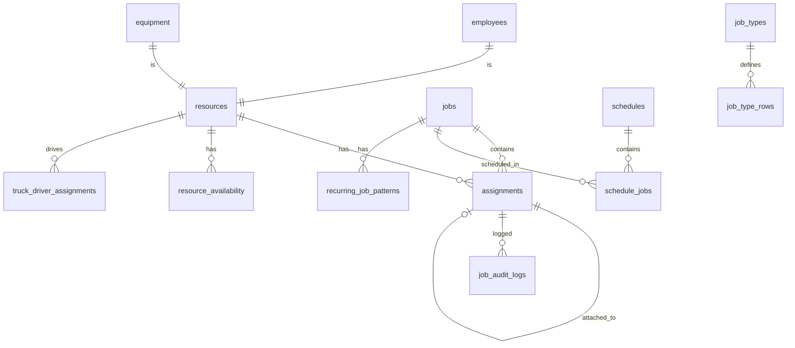

# Database Schema

## Quick Answer
BoardOS uses PostgreSQL via Supabase with 15+ tables managing resources, jobs, assignments, and business rules. The schema supports real-time subscriptions, Row Level Security, and complex relationships with referential integrity.

## Database Overview



## Core Tables

### resources
Central resource catalog for all equipment, vehicles, and personnel.

```sql
CREATE TABLE resources (
  id UUID PRIMARY KEY DEFAULT gen_random_uuid(),
  type TEXT NOT NULL CHECK (type IN (
    'operator', 'driver', 'striper', 'foreman', 'laborer', 
    'privateDriver', 'skidsteer', 'paver', 'excavator', 
    'sweeper', 'millingMachine', 'grader', 'dozer', 
    'payloader', 'roller', 'equipment', 'truck'
  )),
  class_type TEXT, -- Subtype (e.g., '10W' for trucks)
  name TEXT NOT NULL,
  identifier TEXT, -- Equipment ID or employee number
  model TEXT, -- Equipment model
  vin TEXT, -- Vehicle identification number
  location TEXT, -- Current location
  on_site BOOLEAN DEFAULT false,
  is_active BOOLEAN DEFAULT true,
  created_at TIMESTAMPTZ DEFAULT NOW(),
  updated_at TIMESTAMPTZ DEFAULT NOW()
);

-- Indexes for performance
CREATE INDEX idx_resources_type ON resources(type);
CREATE INDEX idx_resources_active ON resources(is_active);
CREATE INDEX idx_resources_identifier ON resources(identifier);
```

### jobs
Construction projects with scheduling and shift information.

```sql
CREATE TABLE jobs (
  id UUID PRIMARY KEY DEFAULT gen_random_uuid(),
  name TEXT NOT NULL,
  job_number TEXT,
  type TEXT NOT NULL CHECK (type IN ('street', 'highway', 'parking-lot')),
  shift TEXT NOT NULL CHECK (shift IN ('day', 'night')),
  notes TEXT,
  start_time TEXT, -- Format: 'HH:MM'
  finalized BOOLEAN DEFAULT false,
  plants TEXT[], -- Array of plant locations
  location JSONB, -- {type: 'onSite' | 'yard', details: {...}}
  schedule_date DATE DEFAULT CURRENT_DATE,
  recurrence_pattern JSONB,
  is_template BOOLEAN DEFAULT false,
  original_job_id UUID REFERENCES jobs(id),
  created_at TIMESTAMPTZ DEFAULT NOW(),
  updated_at TIMESTAMPTZ DEFAULT NOW()
);

-- Indexes
CREATE INDEX idx_jobs_schedule_date ON jobs(schedule_date);
CREATE INDEX idx_jobs_shift ON jobs(shift);
CREATE INDEX idx_jobs_finalized ON jobs(finalized);
CREATE INDEX idx_jobs_template ON jobs(is_template) WHERE is_template = true;
```

### assignments
Links resources to jobs with position and attachment information.

```sql
CREATE TABLE assignments (
  id UUID PRIMARY KEY DEFAULT gen_random_uuid(),
  resource_id UUID REFERENCES resources(id) ON DELETE CASCADE,
  job_id UUID REFERENCES jobs(id) ON DELETE CASCADE,
  row_type TEXT NOT NULL CHECK (row_type IN (
    'Forman', 'Equipment', 'Crew', 'Trucks', 
    'Sweeper', 'Tack', 'MPT'
  )),
  position INTEGER DEFAULT 0,
  attached_to_assignment_id UUID REFERENCES assignments(id),
  time_slot JSONB, -- {start: 'HH:MM', end: 'HH:MM', type: 'onSite'|'yard'}
  note TEXT,
  truck_config JSONB, -- {tag: '10W', hasFlowboy: true, ...}
  schedule_date DATE DEFAULT CURRENT_DATE,
  created_at TIMESTAMPTZ DEFAULT NOW(),
  updated_at TIMESTAMPTZ DEFAULT NOW()
);

-- Indexes for performance
CREATE INDEX idx_assignments_resource ON assignments(resource_id);
CREATE INDEX idx_assignments_job ON assignments(job_id);
CREATE INDEX idx_assignments_schedule ON assignments(job_id, schedule_date);
CREATE INDEX idx_assignments_resource_date ON assignments(resource_id, schedule_date);
CREATE INDEX idx_assignments_attached ON assignments(attached_to_assignment_id);

-- Unique constraint to prevent double-booking
CREATE UNIQUE INDEX idx_unique_resource_job_date 
  ON assignments(resource_id, job_id, schedule_date)
  WHERE attached_to_assignment_id IS NULL;
```

## Employee & Equipment Tables

### employees
Detailed employee information extending resources.

```sql
CREATE TABLE employees (
  id UUID PRIMARY KEY DEFAULT gen_random_uuid(),
  user_id UUID REFERENCES auth.users(id),
  type TEXT NOT NULL, -- Maps to resource type
  name TEXT NOT NULL,
  employee_id TEXT UNIQUE,
  phone_number TEXT,
  emergency_contact_name TEXT,
  emergency_contact_phone TEXT,
  email TEXT,
  address TEXT,
  hire_date DATE,
  role TEXT,
  certifications TEXT[],
  skills TEXT[],
  permissions TEXT[],
  performance_reviews JSONB,
  training_records JSONB,
  is_active BOOLEAN DEFAULT true,
  created_at TIMESTAMPTZ DEFAULT NOW(),
  updated_at TIMESTAMPTZ DEFAULT NOW()
);

-- Indexes
CREATE INDEX idx_employees_type ON employees(type);
CREATE INDEX idx_employees_user ON employees(user_id);
CREATE INDEX idx_employees_active ON employees(is_active);
```

### equipment
Detailed equipment information extending resources.

```sql
CREATE TABLE equipment (
  id UUID PRIMARY KEY DEFAULT gen_random_uuid(),
  type TEXT NOT NULL, -- Maps to resource type
  name TEXT NOT NULL,
  identifier TEXT UNIQUE,
  model TEXT,
  make TEXT,
  year INTEGER,
  vin TEXT,
  serial_number TEXT,
  location TEXT,
  on_site BOOLEAN DEFAULT false,
  acquisition_date DATE,
  purchase_price DECIMAL(12,2),
  current_value DECIMAL(12,2),
  fuel_type TEXT,
  engine_hours DECIMAL(10,2),
  last_maintenance_date DATE,
  next_maintenance_date DATE,
  maintenance_notes TEXT,
  insurance_policy TEXT,
  registration_expiry DATE,
  inspection_date DATE,
  is_operational BOOLEAN DEFAULT true,
  is_active BOOLEAN DEFAULT true,
  created_at TIMESTAMPTZ DEFAULT NOW(),
  updated_at TIMESTAMPTZ DEFAULT NOW()
);

-- Indexes
CREATE INDEX idx_equipment_type ON equipment(type);
CREATE INDEX idx_equipment_operational ON equipment(is_operational);
CREATE INDEX idx_equipment_maintenance ON equipment(next_maintenance_date);
```

## Business Rules Tables

### magnet_interaction_rules
Defines how resources can attach to each other (e.g., operator to equipment).

```sql
CREATE TABLE magnet_interaction_rules (
  id UUID PRIMARY KEY DEFAULT gen_random_uuid(),
  source_type TEXT NOT NULL,
  target_type TEXT NOT NULL,
  can_attach BOOLEAN DEFAULT true,
  is_required BOOLEAN DEFAULT false,
  priority INTEGER DEFAULT 0,
  conditions JSONB, -- Additional conditions
  created_at TIMESTAMPTZ DEFAULT NOW()
);

-- Sample rules
INSERT INTO magnet_interaction_rules (source_type, target_type, is_required) VALUES
  ('operator', 'excavator', true),
  ('operator', 'paver', true),
  ('driver', 'truck', true),
  ('screwman', 'paver', false);

-- Index for rule lookups
CREATE INDEX idx_magnet_rules_types ON magnet_interaction_rules(source_type, target_type);
```

### drop_rules
Controls where resources can be dropped in the UI.

```sql
CREATE TABLE drop_rules (
  id UUID PRIMARY KEY DEFAULT gen_random_uuid(),
  resource_type TEXT NOT NULL,
  row_type TEXT NOT NULL,
  allowed BOOLEAN DEFAULT true,
  priority INTEGER DEFAULT 0,
  created_at TIMESTAMPTZ DEFAULT NOW()
);

-- Sample rules
INSERT INTO drop_rules (resource_type, row_type, allowed) VALUES
  ('foreman', 'Forman', true),
  ('foreman', 'Equipment', false),
  ('excavator', 'Equipment', true),
  ('truck', 'Trucks', true);

-- Index for rule lookups
CREATE INDEX idx_drop_rules_lookup ON drop_rules(resource_type, row_type);
```

### job_type_rows
Defines row structure for different job types.

```sql
CREATE TABLE job_type_rows (
  id UUID PRIMARY KEY DEFAULT gen_random_uuid(),
  job_type_id UUID REFERENCES job_types(id) ON DELETE CASCADE,
  row_type TEXT NOT NULL,
  label TEXT NOT NULL,
  position INTEGER DEFAULT 0,
  min_resources INTEGER DEFAULT 0,
  max_resources INTEGER,
  required_resource_types TEXT[],
  created_at TIMESTAMPTZ DEFAULT NOW()
);

-- Index for job type lookups
CREATE INDEX idx_job_type_rows_type ON job_type_rows(job_type_id);
```

## Scheduling Tables

### schedules
Multi-day schedule management.

```sql
CREATE TABLE schedules (
  id UUID PRIMARY KEY DEFAULT gen_random_uuid(),
  name TEXT NOT NULL,
  description TEXT,
  start_date DATE NOT NULL,
  end_date DATE NOT NULL,
  is_template BOOLEAN DEFAULT false,
  created_by UUID,
  created_at TIMESTAMPTZ DEFAULT NOW(),
  updated_at TIMESTAMPTZ DEFAULT NOW()
);

-- Index for date range queries
CREATE INDEX idx_schedules_dates ON schedules(start_date, end_date);
```

### schedule_jobs
Links jobs to schedules with specific dates.

```sql
CREATE TABLE schedule_jobs (
  id UUID PRIMARY KEY DEFAULT gen_random_uuid(),
  schedule_id UUID REFERENCES schedules(id) ON DELETE CASCADE,
  job_id UUID REFERENCES jobs(id) ON DELETE CASCADE,
  scheduled_date DATE NOT NULL,
  sequence_order INTEGER,
  created_at TIMESTAMPTZ DEFAULT NOW(),
  UNIQUE(job_id, scheduled_date)
);

-- Indexes
CREATE INDEX idx_schedule_jobs_schedule ON schedule_jobs(schedule_id);
CREATE INDEX idx_schedule_jobs_date ON schedule_jobs(scheduled_date);
```

### resource_availability
Tracks resource availability and time off.

```sql
CREATE TABLE resource_availability (
  id UUID PRIMARY KEY DEFAULT gen_random_uuid(),
  resource_id UUID REFERENCES resources(id) ON DELETE CASCADE,
  start_date DATE NOT NULL,
  end_date DATE NOT NULL,
  availability_type TEXT NOT NULL CHECK (availability_type IN (
    'available', 'unavailable', 'vacation', 'sick', 'maintenance'
  )),
  notes TEXT,
  created_by UUID,
  created_at TIMESTAMPTZ DEFAULT NOW(),
  updated_at TIMESTAMPTZ DEFAULT NOW()
);

-- Indexes for availability queries
CREATE INDEX idx_resource_availability_dates ON resource_availability(start_date, end_date);
CREATE INDEX idx_resource_availability_resource ON resource_availability(resource_id);
```

### recurring_job_patterns
Defines recurring job patterns.

```sql
CREATE TABLE recurring_job_patterns (
  id UUID PRIMARY KEY DEFAULT gen_random_uuid(),
  job_id UUID REFERENCES jobs(id) ON DELETE CASCADE,
  pattern_type TEXT NOT NULL CHECK (pattern_type IN (
    'daily', 'weekly', 'biweekly', 'monthly', 'custom'
  )),
  pattern_config JSONB NOT NULL, -- {daysOfWeek: [1,3,5], interval: 2}
  start_date DATE NOT NULL,
  end_date DATE,
  exceptions DATE[], -- Dates to skip
  is_active BOOLEAN DEFAULT true,
  created_at TIMESTAMPTZ DEFAULT NOW(),
  updated_at TIMESTAMPTZ DEFAULT NOW()
);

-- Index for active patterns
CREATE INDEX idx_recurring_patterns_active ON recurring_job_patterns(is_active);
CREATE INDEX idx_recurring_patterns_job ON recurring_job_patterns(job_id);
```

## Audit & Logging Tables

### job_audit_logs
Tracks all changes to jobs for compliance and debugging.

```sql
CREATE TABLE job_audit_logs (
  id UUID PRIMARY KEY DEFAULT gen_random_uuid(),
  job_id UUID REFERENCES jobs(id),
  user_id UUID,
  action TEXT NOT NULL, -- 'created', 'updated', 'deleted', 'finalized'
  old_data JSONB,
  new_data JSONB,
  metadata JSONB, -- Additional context
  created_at TIMESTAMPTZ DEFAULT NOW()
);

-- Indexes for audit queries
CREATE INDEX idx_audit_logs_job ON job_audit_logs(job_id);
CREATE INDEX idx_audit_logs_user ON job_audit_logs(user_id);
CREATE INDEX idx_audit_logs_action ON job_audit_logs(action);
CREATE INDEX idx_audit_logs_created ON job_audit_logs(created_at DESC);
```

### assignment_audit_logs
Tracks assignment changes.

```sql
CREATE TABLE assignment_audit_logs (
  id UUID PRIMARY KEY DEFAULT gen_random_uuid(),
  assignment_id UUID,
  resource_id UUID,
  job_id UUID,
  user_id UUID,
  action TEXT NOT NULL, -- 'assigned', 'removed', 'moved', 'attached'
  details JSONB,
  created_at TIMESTAMPTZ DEFAULT NOW()
);

-- Indexes
CREATE INDEX idx_assignment_audit_resource ON assignment_audit_logs(resource_id);
CREATE INDEX idx_assignment_audit_job ON assignment_audit_logs(job_id);
CREATE INDEX idx_assignment_audit_created ON assignment_audit_logs(created_at DESC);
```

## Supporting Tables

### job_types
Defines types of construction jobs.

```sql
CREATE TABLE job_types (
  id UUID PRIMARY KEY DEFAULT gen_random_uuid(),
  name TEXT NOT NULL UNIQUE,
  description TEXT,
  default_rows JSONB, -- Default row configuration
  default_resources JSONB,
  typical_duration INTEGER, -- In hours
  is_active BOOLEAN DEFAULT true,
  created_at TIMESTAMPTZ DEFAULT NOW()
);
```

### job_row_configs
Dynamic row configurations for jobs.

```sql
CREATE TABLE job_row_configs (
  id UUID PRIMARY KEY DEFAULT gen_random_uuid(),
  job_id UUID REFERENCES jobs(id) ON DELETE CASCADE,
  row_type TEXT NOT NULL,
  label TEXT,
  position INTEGER DEFAULT 0,
  min_resources INTEGER DEFAULT 0,
  max_resources INTEGER,
  box_configs JSONB, -- [{size: 2, attachmentRules: [...]}]
  created_at TIMESTAMPTZ DEFAULT NOW()
);

-- Index for job lookups
CREATE INDEX idx_job_row_configs_job ON job_row_configs(job_id);
```

### truck_driver_assignments
Permanent truck-driver relationships.

```sql
CREATE TABLE truck_driver_assignments (
  id UUID PRIMARY KEY DEFAULT gen_random_uuid(),
  truck_id UUID REFERENCES resources(id),
  driver_id UUID REFERENCES resources(id),
  is_primary BOOLEAN DEFAULT true,
  start_date DATE DEFAULT CURRENT_DATE,
  end_date DATE,
  created_at TIMESTAMPTZ DEFAULT NOW()
);

-- Indexes
CREATE INDEX idx_truck_driver_truck ON truck_driver_assignments(truck_id);
CREATE INDEX idx_truck_driver_driver ON truck_driver_assignments(driver_id);
```

## Database Functions

### update_updated_at_column()
Automatically updates the updated_at timestamp.

```sql
CREATE OR REPLACE FUNCTION update_updated_at_column()
RETURNS TRIGGER AS $$
BEGIN
  NEW.updated_at = NOW();
  RETURN NEW;
END;
$$ LANGUAGE plpgsql;

-- Apply to all tables with updated_at
CREATE TRIGGER update_resources_updated_at 
  BEFORE UPDATE ON resources 
  FOR EACH ROW EXECUTE FUNCTION update_updated_at_column();
```

### check_resource_availability()
Validates resource availability before assignment.

```sql
CREATE OR REPLACE FUNCTION check_resource_availability(
  p_resource_id UUID,
  p_job_id UUID,
  p_date DATE
) RETURNS BOOLEAN AS $$
DECLARE
  v_is_available BOOLEAN;
BEGIN
  -- Check if resource is already assigned
  SELECT NOT EXISTS (
    SELECT 1 FROM assignments
    WHERE resource_id = p_resource_id
    AND job_id != p_job_id
    AND schedule_date = p_date
  ) INTO v_is_available;
  
  -- Check resource availability table
  IF v_is_available THEN
    SELECT NOT EXISTS (
      SELECT 1 FROM resource_availability
      WHERE resource_id = p_resource_id
      AND p_date BETWEEN start_date AND end_date
      AND availability_type != 'available'
    ) INTO v_is_available;
  END IF;
  
  RETURN v_is_available;
END;
$$ LANGUAGE plpgsql;
```

### validate_equipment_operator()
Ensures equipment has required operators.

```sql
CREATE OR REPLACE FUNCTION validate_equipment_operator()
RETURNS TRIGGER AS $$
BEGIN
  -- Check if this is equipment requiring an operator
  IF EXISTS (
    SELECT 1 FROM resources 
    WHERE id = NEW.resource_id 
    AND type IN ('excavator', 'paver', 'millingMachine', 'grader')
  ) THEN
    -- Ensure there's an operator assigned to the same job
    IF NOT EXISTS (
      SELECT 1 FROM assignments a
      JOIN resources r ON a.resource_id = r.id
      WHERE a.job_id = NEW.job_id
      AND r.type = 'operator'
      AND (a.attached_to_assignment_id = NEW.id 
           OR NEW.attached_to_assignment_id = a.id)
    ) THEN
      RAISE EXCEPTION 'Equipment requires an operator';
    END IF;
  END IF;
  
  RETURN NEW;
END;
$$ LANGUAGE plpgsql;

CREATE TRIGGER check_equipment_operator
  AFTER INSERT OR UPDATE ON assignments
  FOR EACH ROW EXECUTE FUNCTION validate_equipment_operator();
```

## Real-time Subscriptions

Enable real-time updates for all core tables:

```sql
-- Enable real-time for core tables
ALTER PUBLICATION supabase_realtime ADD TABLE resources;
ALTER PUBLICATION supabase_realtime ADD TABLE jobs;
ALTER PUBLICATION supabase_realtime ADD TABLE assignments;
ALTER PUBLICATION supabase_realtime ADD TABLE resource_availability;
ALTER PUBLICATION supabase_realtime ADD TABLE schedule_jobs;
```

## Performance Optimization

### Indexes Strategy
- Primary keys: UUID with B-tree index
- Foreign keys: Indexed for JOIN performance
- Lookup fields: Indexed for WHERE clauses
- Date ranges: Compound indexes for range queries
- Partial indexes: For filtered queries (e.g., active records)

### Query Optimization
```sql
-- Example: Efficient resource availability query
CREATE VIEW available_resources AS
SELECT r.*
FROM resources r
WHERE r.is_active = true
AND NOT EXISTS (
  SELECT 1 FROM assignments a
  WHERE a.resource_id = r.id
  AND a.schedule_date = CURRENT_DATE
)
AND NOT EXISTS (
  SELECT 1 FROM resource_availability ra
  WHERE ra.resource_id = r.id
  AND CURRENT_DATE BETWEEN ra.start_date AND ra.end_date
  AND ra.availability_type != 'available'
);
```

## Migration Strategy

### Version Control
All schema changes tracked in migrations:
```
supabase/migrations/
├── 20250826_add_schedule_support.sql
├── 20250828_add_audit_logging.sql
└── 20250828_job_duration_estimation.sql
```

### Safe Migration Pattern
```sql
-- Always use IF NOT EXISTS for additions
ALTER TABLE jobs 
ADD COLUMN IF NOT EXISTS new_field TEXT;

-- Use transactions for complex changes
BEGIN;
  ALTER TABLE assignments ADD COLUMN temp_field TEXT;
  UPDATE assignments SET temp_field = old_field;
  ALTER TABLE assignments DROP COLUMN old_field;
  ALTER TABLE assignments RENAME COLUMN temp_field TO new_field;
COMMIT;
```

## Backup & Recovery

### Backup Strategy
```sql
-- Daily automated backups via Supabase
-- Point-in-time recovery available
-- Manual backup before major migrations:
pg_dump $DATABASE_URL > backup_$(date +%Y%m%d).sql
```

### Data Integrity Checks
```sql
-- Regular integrity validation
SELECT 'Orphaned assignments' AS check,
       COUNT(*) AS count
FROM assignments a
WHERE NOT EXISTS (
  SELECT 1 FROM resources r WHERE r.id = a.resource_id
)
OR NOT EXISTS (
  SELECT 1 FROM jobs j WHERE j.id = a.job_id
);
```

The database schema provides a robust foundation for BoardOS with strong referential integrity, performance optimization, and support for complex business rules.