# Architecture Overview

## Quick Answer
BoardOS is a React 18 TypeScript application with real-time drag-and-drop scheduling, built using Context-based state management, Supabase backend, and sophisticated business rule engine for construction resource allocation.

## System Architecture

### High-Level Architecture

```mermaid
graph TB
    User[👤 User Interface] --> App[React App Layer]
    App --> Context[Context Layer]
    Context --> Services[Service Layer]
    Services --> DB[(Supabase Database)]
    Services --> Edge[Edge Functions]
    
    subgraph "React App Layer"
        Components[Components]
        Hooks[Custom Hooks]
        Utils[Utilities]
    end
    
    subgraph "Context Layer"
        Scheduler[SchedulerContext]
        Mobile[MobileContext]
        Drag[DragContext]
        Modal[ModalContext]
        Keyboard[KeyboardShortcutsContext]
    end
    
    subgraph "Service Layer"
        DatabaseService[DatabaseService]
        ExportService[ExportService]
        DurationService[DurationEstimationService]
    end
    
    subgraph "Business Logic"
        Magnets[Magnet System]
        Rules[Business Rules]
        Validation[Validation Engine]
    end
```



### Technology Stack

| Layer | Technology | Purpose |
|-------|------------|---------|
| **Frontend** | React 18 + TypeScript | UI framework with concurrent features |
| **State** | React Context API | Application state management |
| **Styling** | Tailwind CSS | Utility-first CSS framework |
| **Drag & Drop** | react-dnd | Mouse and touch drag interactions |
| **Animation** | Framer Motion | Smooth UI animations |
| **Database** | Supabase PostgreSQL | Real-time database with subscriptions |
| **Build** | Vite | Fast development and build tool |
| **Testing** | Vitest + React Testing Library | Unit and integration testing |

## Core Architecture Patterns

### 1. Component Architecture

```
src/components/
├── board/          # Main scheduling interface
├── resources/      # Resource cards and pools  
├── modals/         # Dialog and popup components
├── mobile/         # Mobile-optimized components
├── ui/             # Reusable UI components
└── common/         # Shared components
```

**Design Principles:**
- Single responsibility per component
- Props-based communication
- Composition over inheritance
- Mobile-first responsive design

### 2. State Management Pattern


**State Flow:**
1. Components consume context via hooks
2. Actions modify state immutably
3. Real-time subscriptions update state
4. Optimistic updates provide instant feedback

### 3. Data Flow Architecture


### 4. Business Logic Architecture

```typescript
interface BusinessRule {
  validate: (operation: Operation) => ValidationResult;
  enforce: (operation: Operation) => EnforcedOperation;
  conflicts: (operation: Operation) => Conflict[];
}

// Magnet System - Core Business Logic
class MagnetSystem {
  // Equipment must have operators (safety requirement)
  enforceOperatorRequirement(equipment: Equipment): ValidationResult
  
  // Time conflict detection and resolution
  detectTimeConflicts(assignments: Assignment[]): TimeConflict[]
  
  // Attachment rules (operators to equipment, drivers to trucks)
  validateAttachments(assignment: Assignment): AttachmentResult
}
```

## Key Architectural Components

### 1. SchedulerContext - Central State Hub

```typescript
interface SchedulerContextType {
  // Core data
  jobs: Job[];
  resources: Resource[];
  assignments: Assignment[];
  
  // Business rules
  magnetInteractionRules: MagnetInteractionRule[];
  dropRules: DropRule[];
  
  // Actions
  assignResource: (resourceId: string, jobId: string) => Promise<string>;
  removeAssignment: (assignmentId: string) => Promise<void>;
  attachResources: (targetId: string, sourceId: string) => Promise<void>;
  
  // Real-time subscriptions
  subscribeToChanges: () => Subscription[];
}
```

**Responsibilities:**
- Centralized state management
- Business rule enforcement
- Real-time data synchronization
- Optimistic UI updates

### 2. Magnet System - Business Logic Engine

```typescript
class Magnet {
  // Resource representation with business logic
  id: string;
  type: ResourceType;
  status: MagnetStatus;
  assignments: Assignment[];
  
  // Core operations
  assignToJob(jobId: string, position: number): string;
  attachTo(targetMagnet: Magnet): boolean;
  validateRequirements(): ValidationResult;
}

class MagnetManager {
  // Global magnet coordination
  magnets: Map<string, Magnet>;
  
  linkMagnets(sourceId: string, targetId: string): boolean;
  validateOperation(operation: Operation): ValidationResult;
  enforceBusinessRules(assignments: Assignment[]): Assignment[];
}
```

### 3. DatabaseService - Data Access Layer

```typescript
class DatabaseService {
  // Resource management
  static async assignResource(
    resourceId: string, 
    jobId: string, 
    rowType: RowType
  ): Promise<AssignmentResult>;
  
  // Atomic operations
  static async moveAssignmentGroup(
    assignments: Assignment[], 
    targetJob: string
  ): Promise<MoveResult>;
  
  // Real-time subscriptions
  static subscribeToAssignmentChanges(
    callback: (changes: Assignment[]) => void
  ): Subscription;
}
```

## Performance Architecture

### 1. Optimization Strategies

| Strategy | Implementation | Impact |
|----------|---------------|--------|
| **Memoization** | useMemo, React.memo | Prevents unnecessary re-renders |
| **Debouncing** | Custom useDebounce hook | Reduces API calls |
| **Virtual Scrolling** | Large list optimization | Handles 1000+ items |
| **Optimistic Updates** | Immediate UI feedback | Sub-100ms response times |
| **Code Splitting** | Dynamic imports | Faster initial load |

### 2. Real-time Performance


**Performance Metrics:**
- Real-time latency: <200ms
- UI update time: <50ms
- Drag operation response: <16ms (60fps)
- Database query time: <100ms

## Security Architecture

### 1. Row Level Security (RLS)

```sql
-- Jobs accessible only to organization members
CREATE POLICY "org_jobs_policy" ON jobs
FOR ALL USING (organization_id = auth.organization_id());

-- Assignments follow job permissions
CREATE POLICY "assignments_policy" ON assignments
FOR ALL USING (
  job_id IN (
    SELECT id FROM jobs 
    WHERE organization_id = auth.organization_id()
  )
);
```

### 2. Type Safety

```typescript
// Strict TypeScript configuration
{
  "strict": true,
  "noImplicitAny": true,
  "strictNullChecks": true,
  "strictFunctionTypes": true
}

// Runtime validation with Zod
const AssignmentSchema = z.object({
  resourceId: z.string().uuid(),
  jobId: z.string().uuid(),
  rowType: z.enum(['Equipment', 'Crew', 'Trucks'])
});
```

## Mobile Architecture

### 1. Responsive Design Pattern

```typescript
// Mobile context detection
const MobileContext = {
  isMobile: boolean;
  touchEnabled: boolean;
  orientation: 'portrait' | 'landscape';
  breakpoint: 'sm' | 'md' | 'lg' | 'xl';
}

// Adaptive components
const ComponentRenderer = {
  renderDesktop: () => <DesktopJobColumn />,
  renderMobile: () => <MobileJobCard />,
  renderTablet: () => <TabletJobRow />
}
```

### 2. Touch Optimization

- **Touch targets**: Minimum 44px for accessibility
- **Drag feedback**: Visual indicators during touch drag
- **Gesture support**: Pinch, zoom, swipe navigation
- **Performance**: 60fps touch responses

## Scalability Architecture

### 1. Horizontal Scaling

| Component | Scaling Strategy | Limit |
|-----------|-----------------|-------|
| **Frontend** | CDN distribution | Global |
| **Database** | Read replicas | Multi-region |
| **Edge Functions** | Auto-scaling | 1M+ requests/day |
| **Real-time** | Connection pooling | 10K+ concurrent users |

### 2. Data Partitioning

```sql
-- Partition by organization for multi-tenancy
CREATE TABLE jobs_partitioned (
  id uuid,
  organization_id uuid,
  -- other fields
) PARTITION BY HASH (organization_id);
```

## Testing Architecture

### 1. Testing Pyramid


### 2. Test Coverage Strategy

- **Unit Tests**: 80%+ coverage for business logic
- **Integration Tests**: Critical user flows
- **E2E Tests**: Complete scheduling workflows
- **Performance Tests**: Load testing for 100+ concurrent users

## Future Architecture Considerations

### 1. Microservices Migration


### 2. Event-Driven Architecture

```typescript
interface DomainEvent {
  eventId: string;
  eventType: string;
  aggregateId: string;
  timestamp: Date;
  data: any;
}

// Event sourcing for audit trail
class EventStore {
  append(events: DomainEvent[]): Promise<void>;
  getEvents(aggregateId: string): Promise<DomainEvent[]>;
  subscribe(eventType: string, handler: EventHandler): Subscription;
}
```

### 3. Performance Optimizations

- **Service Workers**: Offline capability
- **Web Workers**: Heavy computation offloading
- **IndexedDB**: Client-side caching
- **GraphQL**: Efficient data fetching
- **Micro-frontends**: Team independence

---

## Architecture Decision Records (ADRs)

### ADR-001: Context over Redux
**Decision**: Use React Context instead of Redux for state management
**Rationale**: Simpler setup, built-in React feature, sufficient for current scale
**Trade-offs**: Less sophisticated dev tools, manual optimization required

### ADR-002: Supabase over Custom Backend
**Decision**: Use Supabase as backend-as-a-service
**Rationale**: Real-time subscriptions, built-in auth, PostgreSQL compatibility
**Trade-offs**: Vendor lock-in, limited customization for complex queries

### ADR-003: TypeScript Strict Mode
**Decision**: Enable strict TypeScript configuration
**Rationale**: Catch errors at compile time, better developer experience
**Trade-offs**: Longer development time, more verbose code

This architecture provides a solid foundation for a scalable, maintainable construction scheduling application with room for future growth and optimization.