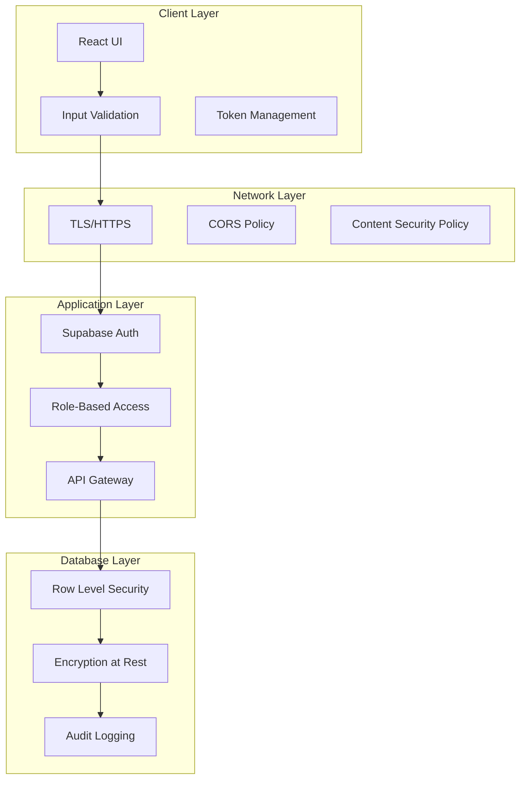

# Security Architecture

## Quick Answer
BoardOS implements defense-in-depth security using Supabase Auth for authentication, PostgreSQL Row Level Security for authorization, encrypted connections, input validation, and comprehensive audit logging. All sensitive operations require authentication and appropriate permissions.

## Security Overview



## Authentication

### Supabase Auth Integration
Primary authentication system using JWT tokens.

```typescript
// Authentication configuration
const authConfig = {
  // Session management
  persistSession: true,
  autoRefreshToken: true,
  detectSessionInUrl: true,
  
  // Security settings
  flowType: 'pkce', // Proof Key for Code Exchange
  storageKey: 'boardos-auth-token',
  
  // Token configuration
  jwt: {
    secret: process.env.SUPABASE_JWT_SECRET,
    expiry: 3600, // 1 hour
    refreshThreshold: 300 // Refresh 5 minutes before expiry
  }
};
```

### Authentication Flow

```typescript
// Login implementation
export const authenticateUser = async (
  email: string, 
  password: string
): Promise<AuthResponse> => {
  // Input validation
  if (!validateEmail(email)) {
    throw new Error('Invalid email format');
  }
  
  if (!validatePassword(password)) {
    throw new Error('Password does not meet requirements');
  }
  
  // Attempt authentication
  const { data, error } = await supabase.auth.signInWithPassword({
    email: sanitizeInput(email),
    password: password // Never log passwords
  });
  
  if (error) {
    // Log attempt without sensitive data
    logger.warn('Authentication failed', { 
      email: hashEmail(email),
      timestamp: new Date().toISOString()
    });
    throw error;
  }
  
  // Set secure session
  await setSecureSession(data.session);
  
  return data;
};
```

### Session Management

```typescript
// Secure session handling
class SessionManager {
  private static readonly SESSION_KEY = 'boardos-session';
  private static readonly REFRESH_INTERVAL = 5 * 60 * 1000; // 5 minutes
  
  static async initializeSession(): Promise<void> {
    // Check for existing session
    const { data: { session } } = await supabase.auth.getSession();
    
    if (session) {
      this.validateSession(session);
      this.scheduleTokenRefresh();
    }
  }
  
  private static validateSession(session: Session): boolean {
    // Verify token signature
    const isValid = verifyJWT(session.access_token);
    
    // Check token expiry
    const isExpired = session.expires_at < Date.now() / 1000;
    
    // Validate user permissions
    const hasPermissions = this.checkUserPermissions(session.user);
    
    return isValid && !isExpired && hasPermissions;
  }
  
  private static scheduleTokenRefresh(): void {
    setInterval(async () => {
      const { data, error } = await supabase.auth.refreshSession();
      
      if (error) {
        // Handle refresh failure
        await this.handleSessionExpired();
      }
    }, this.REFRESH_INTERVAL);
  }
}
```

## Authorization

### Role-Based Access Control (RBAC)

```typescript
// Role definitions
enum UserRole {
  ADMIN = 'admin',
  MANAGER = 'manager',
  SCHEDULER = 'scheduler',
  OPERATOR = 'operator',
  VIEWER = 'viewer'
}

// Permission matrix
const permissions = {
  [UserRole.ADMIN]: ['*'], // All permissions
  [UserRole.MANAGER]: [
    'jobs.create', 'jobs.update', 'jobs.delete',
    'resources.create', 'resources.update',
    'assignments.*', 'reports.*'
  ],
  [UserRole.SCHEDULER]: [
    'jobs.read', 'jobs.update',
    'resources.read',
    'assignments.*'
  ],
  [UserRole.OPERATOR]: [
    'jobs.read',
    'resources.read',
    'assignments.read'
  ],
  [UserRole.VIEWER]: [
    '*.read'
  ]
};

// Authorization check
export const authorize = (
  user: User, 
  action: string, 
  resource?: any
): boolean => {
  const userPermissions = permissions[user.role] || [];
  
  // Check wildcard permissions
  if (userPermissions.includes('*')) return true;
  if (userPermissions.includes(`${action.split('.')[0]}.*`)) return true;
  
  // Check specific permission
  if (userPermissions.includes(action)) {
    // Additional resource-level checks
    if (resource) {
      return checkResourceAccess(user, resource);
    }
    return true;
  }
  
  return false;
};
```

### Row Level Security (RLS)

PostgreSQL policies enforcing data access at database level.

```sql
-- Enable RLS on all tables
ALTER TABLE resources ENABLE ROW LEVEL SECURITY;
ALTER TABLE jobs ENABLE ROW LEVEL SECURITY;
ALTER TABLE assignments ENABLE ROW LEVEL SECURITY;

-- Policy: Users can read all resources
CREATE POLICY "Resources are viewable by authenticated users"
  ON resources FOR SELECT
  TO authenticated
  USING (true);

-- Policy: Only managers can modify resources
CREATE POLICY "Resources are editable by managers"
  ON resources FOR ALL
  TO authenticated
  USING (
    auth.jwt() ->> 'role' IN ('admin', 'manager')
  );

-- Policy: Users can only see their assigned jobs
CREATE POLICY "Users see assigned jobs"
  ON jobs FOR SELECT
  TO authenticated
  USING (
    auth.jwt() ->> 'role' IN ('admin', 'manager')
    OR id IN (
      SELECT job_id FROM assignments
      WHERE resource_id IN (
        SELECT id FROM resources
        WHERE user_id = auth.uid()
      )
    )
  );

-- Policy: Assignment creation requires proper role
CREATE POLICY "Assignment creation"
  ON assignments FOR INSERT
  TO authenticated
  WITH CHECK (
    auth.jwt() ->> 'role' IN ('admin', 'manager', 'scheduler')
    AND check_resource_availability(resource_id, job_id, schedule_date)
  );
```

## Input Validation & Sanitization

### Client-Side Validation

```typescript
// Input validation utilities
export const validators = {
  // Email validation
  email: (value: string): boolean => {
    const emailRegex = /^[^\s@]+@[^\s@]+\.[^\s@]+$/;
    return emailRegex.test(value);
  },
  
  // Phone validation
  phone: (value: string): boolean => {
    const phoneRegex = /^\+?[\d\s-()]+$/;
    return phoneRegex.test(value) && value.replace(/\D/g, '').length >= 10;
  },
  
  // Resource identifier
  resourceId: (value: string): boolean => {
    const uuidRegex = /^[0-9a-f]{8}-[0-9a-f]{4}-4[0-9a-f]{3}-[89ab][0-9a-f]{3}-[0-9a-f]{12}$/i;
    return uuidRegex.test(value);
  },
  
  // Job name
  jobName: (value: string): boolean => {
    return value.length >= 3 && 
           value.length <= 100 && 
           !/[<>'"]/g.test(value); // Prevent XSS
  }
};

// Sanitization functions
export const sanitizers = {
  // Remove HTML tags
  stripHtml: (input: string): string => {
    return input.replace(/<[^>]*>/g, '');
  },
  
  // Escape special characters
  escapeHtml: (input: string): string => {
    const map = {
      '&': '&amp;',
      '<': '&lt;',
      '>': '&gt;',
      '"': '&quot;',
      "'": '&#x27;',
      '/': '&#x2F;'
    };
    return input.replace(/[&<>"'/]/g, char => map[char]);
  },
  
  // SQL injection prevention
  escapeSql: (input: string): string => {
    return input.replace(/['";\\]/g, '');
  }
};
```

### Server-Side Validation

```sql
-- Database constraints
ALTER TABLE resources
  ADD CONSTRAINT valid_resource_type 
  CHECK (type IN ('operator', 'driver', 'equipment', 'truck')),
  
  ADD CONSTRAINT valid_identifier 
  CHECK (identifier ~ '^[A-Z0-9-]+$'),
  
  ADD CONSTRAINT name_length 
  CHECK (char_length(name) BETWEEN 2 AND 100);

-- Validation functions
CREATE OR REPLACE FUNCTION validate_assignment_input()
RETURNS TRIGGER AS $$
BEGIN
  -- Validate resource exists and is active
  IF NOT EXISTS (
    SELECT 1 FROM resources 
    WHERE id = NEW.resource_id AND is_active = true
  ) THEN
    RAISE EXCEPTION 'Invalid or inactive resource';
  END IF;
  
  -- Validate job exists and not finalized
  IF NOT EXISTS (
    SELECT 1 FROM jobs 
    WHERE id = NEW.job_id AND finalized = false
  ) THEN
    RAISE EXCEPTION 'Invalid or finalized job';
  END IF;
  
  -- Validate time slot format
  IF NEW.time_slot IS NOT NULL THEN
    IF NOT (
      NEW.time_slot ? 'start' AND 
      NEW.time_slot ? 'end' AND
      (NEW.time_slot->>'start')::time IS NOT NULL AND
      (NEW.time_slot->>'end')::time IS NOT NULL
    ) THEN
      RAISE EXCEPTION 'Invalid time slot format';
    END IF;
  END IF;
  
  RETURN NEW;
END;
$$ LANGUAGE plpgsql;

CREATE TRIGGER validate_assignment
  BEFORE INSERT OR UPDATE ON assignments
  FOR EACH ROW EXECUTE FUNCTION validate_assignment_input();
```

## API Security

### Request Authentication

```typescript
// API middleware
export const authenticateRequest = async (
  req: Request,
  res: Response,
  next: NextFunction
) => {
  try {
    // Extract token
    const token = req.headers.authorization?.replace('Bearer ', '');
    
    if (!token) {
      return res.status(401).json({ error: 'No token provided' });
    }
    
    // Verify token
    const { data: user, error } = await supabase.auth.getUser(token);
    
    if (error || !user) {
      return res.status(401).json({ error: 'Invalid token' });
    }
    
    // Attach user to request
    req.user = user;
    next();
  } catch (error) {
    logger.error('Authentication error', error);
    res.status(500).json({ error: 'Authentication failed' });
  }
};
```

### Rate Limiting

```typescript
// Rate limiting configuration
import rateLimit from 'express-rate-limit';

export const rateLimiters = {
  // General API limit
  api: rateLimit({
    windowMs: 15 * 60 * 1000, // 15 minutes
    max: 100, // 100 requests per window
    message: 'Too many requests, please try again later'
  }),
  
  // Strict limit for auth endpoints
  auth: rateLimit({
    windowMs: 15 * 60 * 1000,
    max: 5, // 5 attempts per window
    skipSuccessfulRequests: true
  }),
  
  // Lenient limit for read operations
  read: rateLimit({
    windowMs: 1 * 60 * 1000, // 1 minute
    max: 60 // 1 request per second
  })
};
```

### CORS Configuration

```typescript
// CORS security settings
const corsOptions = {
  origin: (origin, callback) => {
    const allowedOrigins = [
      process.env.FRONTEND_URL,
      'https://boardos.com',
      'https://app.boardos.com'
    ];
    
    if (!origin || allowedOrigins.includes(origin)) {
      callback(null, true);
    } else {
      callback(new Error('Not allowed by CORS'));
    }
  },
  credentials: true,
  methods: ['GET', 'POST', 'PUT', 'DELETE', 'OPTIONS'],
  allowedHeaders: ['Content-Type', 'Authorization'],
  maxAge: 86400 // 24 hours
};
```

## Data Protection

### Encryption

```typescript
// Encryption utilities
import crypto from 'crypto';

const algorithm = 'aes-256-gcm';
const secretKey = process.env.ENCRYPTION_KEY;

export const encrypt = (text: string): EncryptedData => {
  const iv = crypto.randomBytes(16);
  const cipher = crypto.createCipheriv(algorithm, secretKey, iv);
  
  let encrypted = cipher.update(text, 'utf8', 'hex');
  encrypted += cipher.final('hex');
  
  const authTag = cipher.getAuthTag();
  
  return {
    encrypted,
    iv: iv.toString('hex'),
    authTag: authTag.toString('hex')
  };
};

export const decrypt = (data: EncryptedData): string => {
  const decipher = crypto.createDecipheriv(
    algorithm,
    secretKey,
    Buffer.from(data.iv, 'hex')
  );
  
  decipher.setAuthTag(Buffer.from(data.authTag, 'hex'));
  
  let decrypted = decipher.update(data.encrypted, 'hex', 'utf8');
  decrypted += decipher.final('utf8');
  
  return decrypted;
};
```

### Sensitive Data Handling

```typescript
// PII protection
export const protectPII = {
  // Hash emails for logging
  hashEmail: (email: string): string => {
    return crypto
      .createHash('sha256')
      .update(email.toLowerCase())
      .digest('hex')
      .substring(0, 8);
  },
  
  // Mask phone numbers
  maskPhone: (phone: string): string => {
    return phone.replace(/\d(?=\d{4})/g, '*');
  },
  
  // Redact sensitive fields
  redactObject: (obj: any, fields: string[]): any => {
    const redacted = { ...obj };
    fields.forEach(field => {
      if (redacted[field]) {
        redacted[field] = '[REDACTED]';
      }
    });
    return redacted;
  }
};
```

## Audit Logging

### Comprehensive Audit Trail

```typescript
// Audit logging system
export class AuditLogger {
  static async log(event: AuditEvent): Promise<void> {
    const auditEntry = {
      id: crypto.randomUUID(),
      timestamp: new Date().toISOString(),
      user_id: event.userId,
      user_email: protectPII.hashEmail(event.userEmail),
      action: event.action,
      resource_type: event.resourceType,
      resource_id: event.resourceId,
      ip_address: event.ipAddress,
      user_agent: event.userAgent,
      success: event.success,
      error: event.error,
      metadata: event.metadata
    };
    
    // Store in database
    await supabase
      .from('audit_logs')
      .insert(auditEntry);
    
    // Alert on suspicious activity
    if (this.isSuspicious(event)) {
      await this.alertSecurity(auditEntry);
    }
  }
  
  private static isSuspicious(event: AuditEvent): boolean {
    // Multiple failed auth attempts
    if (event.action === 'auth.failed' && event.metadata?.attempts > 3) {
      return true;
    }
    
    // Unusual access patterns
    if (event.action.includes('delete') && event.metadata?.count > 10) {
      return true;
    }
    
    // Access from new location
    if (event.metadata?.newLocation) {
      return true;
    }
    
    return false;
  }
}
```

## Security Headers

### HTTP Security Headers

```typescript
// Security headers middleware
export const securityHeaders = (req: Request, res: Response, next: NextFunction) => {
  // Content Security Policy
  res.setHeader(
    'Content-Security-Policy',
    "default-src 'self'; " +
    "script-src 'self' 'unsafe-inline' https://cdn.jsdelivr.net; " +
    "style-src 'self' 'unsafe-inline'; " +
    "img-src 'self' data: https:; " +
    "connect-src 'self' https://*.supabase.co wss://*.supabase.co; " +
    "font-src 'self' data:; " +
    "frame-ancestors 'none';"
  );
  
  // Other security headers
  res.setHeader('X-Content-Type-Options', 'nosniff');
  res.setHeader('X-Frame-Options', 'DENY');
  res.setHeader('X-XSS-Protection', '1; mode=block');
  res.setHeader('Strict-Transport-Security', 'max-age=31536000; includeSubDomains');
  res.setHeader('Referrer-Policy', 'strict-origin-when-cross-origin');
  res.setHeader('Permissions-Policy', 'geolocation=(), microphone=(), camera=()');
  
  next();
};
```

## Vulnerability Prevention

### SQL Injection Prevention

```typescript
// Use parameterized queries
const safeQuery = async (resourceId: string, jobId: string) => {
  // ✅ Safe: Uses parameterized query
  const { data, error } = await supabase
    .from('assignments')
    .select('*')
    .eq('resource_id', resourceId)
    .eq('job_id', jobId);
  
  // ❌ Unsafe: String concatenation
  // const query = `SELECT * FROM assignments WHERE resource_id = '${resourceId}'`;
  
  return data;
};
```

### XSS Prevention

```typescript
// React automatically escapes content
const SafeComponent = ({ userInput }) => {
  // ✅ Safe: React escapes the content
  return <div>{userInput}</div>;
  
  // ❌ Unsafe: Using dangerouslySetInnerHTML
  // return <div dangerouslySetInnerHTML={{ __html: userInput }} />;
};

// Sanitize user input before storage
const sanitizeBeforeStore = (input: string): string => {
  return DOMPurify.sanitize(input, {
    ALLOWED_TAGS: ['b', 'i', 'em', 'strong'],
    ALLOWED_ATTR: []
  });
};
```

### CSRF Protection

```typescript
// CSRF token generation
export const generateCSRFToken = (): string => {
  return crypto.randomBytes(32).toString('hex');
};

// CSRF validation middleware
export const validateCSRF = (req: Request, res: Response, next: NextFunction) => {
  const token = req.headers['x-csrf-token'] || req.body._csrf;
  const sessionToken = req.session.csrfToken;
  
  if (!token || token !== sessionToken) {
    return res.status(403).json({ error: 'Invalid CSRF token' });
  }
  
  next();
};
```

## Security Monitoring

### Real-time Threat Detection

```typescript
// Security monitoring service
class SecurityMonitor {
  private static patterns = {
    bruteForce: { threshold: 5, window: 300000 }, // 5 attempts in 5 minutes
    scanning: { threshold: 20, window: 60000 }, // 20 404s in 1 minute
    dataExfiltration: { threshold: 100, window: 60000 } // 100 reads in 1 minute
  };
  
  static async detectThreats(event: SecurityEvent): Promise<void> {
    // Check for brute force
    if (event.type === 'auth.failed') {
      const attempts = await this.countEvents(
        event.userId,
        'auth.failed',
        this.patterns.bruteForce.window
      );
      
      if (attempts >= this.patterns.bruteForce.threshold) {
        await this.blockUser(event.userId, 'Brute force detected');
      }
    }
    
    // Check for scanning
    if (event.statusCode === 404) {
      const notFounds = await this.countEvents(
        event.ipAddress,
        '404',
        this.patterns.scanning.window
      );
      
      if (notFounds >= this.patterns.scanning.threshold) {
        await this.blockIP(event.ipAddress, 'Scanning detected');
      }
    }
  }
}
```

## Incident Response

### Security Incident Handling

```typescript
// Incident response procedures
export const handleSecurityIncident = async (incident: SecurityIncident) => {
  // 1. Immediate containment
  await containThreat(incident);
  
  // 2. Log incident
  await AuditLogger.log({
    action: 'security.incident',
    severity: incident.severity,
    details: incident
  });
  
  // 3. Notify administrators
  await notifySecurityTeam(incident);
  
  // 4. Collect evidence
  const evidence = await collectEvidence(incident);
  
  // 5. Begin remediation
  await remediateVulnerability(incident, evidence);
  
  // 6. Document lessons learned
  await documentIncident(incident, evidence);
};
```

## Security Best Practices

### Development Guidelines
1. **Never trust user input** - Always validate and sanitize
2. **Use parameterized queries** - Prevent SQL injection
3. **Implement least privilege** - Minimal necessary permissions
4. **Encrypt sensitive data** - Both in transit and at rest
5. **Regular security updates** - Keep dependencies current
6. **Security testing** - Regular penetration testing
7. **Code reviews** - Security-focused reviews
8. **Error handling** - Never expose system details
9. **Secure defaults** - Opt-in for dangerous features
10. **Defense in depth** - Multiple security layers

The security architecture ensures BoardOS maintains data integrity, user privacy, and system availability through comprehensive protection mechanisms.