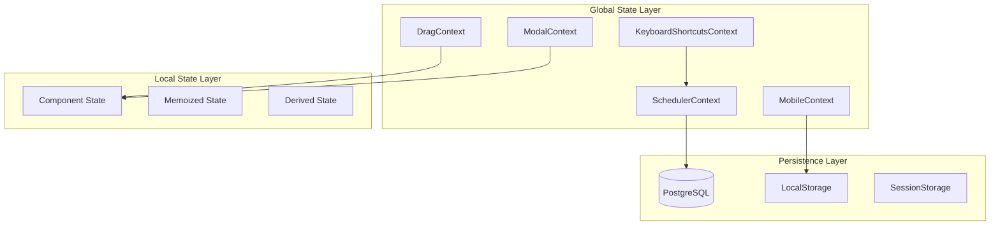

# State Management Architecture

## Quick Answer
BoardOS uses React Context API for state management with five specialized contexts (Scheduler, Drag, Mobile, Modal, KeyboardShortcuts). State is optimistically updated locally, persisted to PostgreSQL, and synchronized via Supabase real-time subscriptions.

## State Management Overview



## State Architecture Principles

### 1. Single Responsibility
Each context manages a specific domain of state.

```typescript
// SchedulerContext: Business data
{ jobs, resources, assignments }

// DragContext: Drag operation state
{ isDragging, draggedItem, dropTarget }

// MobileContext: Device-specific state
{ isMobile, touchPosition, gestureState }

// ModalContext: UI modal state
{ activeModal, modalProps, modalStack }

// KeyboardShortcutsContext: Keyboard interaction
{ shortcuts, activeKeys, quickSelect }
```

### 2. State Colocation
Keep state as close to usage as possible.

```typescript
// Global state: Used across multiple components
const { jobs } = useScheduler();

// Local state: Used in single component
const [isExpanded, setIsExpanded] = useState(false);

// Derived state: Computed from other state
const availableJobs = useMemo(() => 
  jobs.filter(j => j.status === 'pending'),
  [jobs]
);
```

### 3. Immutable Updates
Never mutate state directly.

```typescript
// ❌ Wrong: Direct mutation
state.assignments.push(newAssignment);

// ✅ Correct: Immutable update
setAssignments(prev => [...prev, newAssignment]);

// ✅ Correct: Immutable object update
setJob(prev => ({ ...prev, status: 'active' }));
```

## Context Architecture

### SchedulerContext
Core business state management.

```typescript
interface SchedulerState {
  // Data
  jobs: Job[];
  resources: Resource[];
  assignments: Assignment[];
  
  // UI State
  searchTerm: string;
  filteredResourceType: ResourceType | null;
  selectedView: ViewType;
  
  // Actions
  addJob: (job: Job) => Promise<void>;
  updateJob: (job: Job) => Promise<void>;
  removeJob: (id: string) => Promise<void>;
  assignResource: (resourceId: string, jobId: string) => Promise<string>;
  removeAssignment: (id: string) => Promise<void>;
  
  // Derived State
  availableResources: Resource[];
  assignedResourceIds: Set<string>;
}
```

### DragContext
Drag-and-drop operation state.

```typescript
interface DragState {
  // Drag State
  isDragging: boolean;
  draggedItem: DragItem | null;
  draggedMagnets: Magnet[];
  dropTarget: DropTarget | null;
  
  // Actions
  startDrag: (item: DragItem) => void;
  updateDrag: (position: Position) => void;
  endDrag: () => void;
  setDropTarget: (target: DropTarget | null) => void;
  
  // Helpers
  canDrop: (target: DropTarget) => boolean;
  getDropEffect: () => DropEffect;
}
```

### MobileContext
Mobile device state management.

```typescript
interface MobileState {
  // Device State
  isMobile: boolean;
  deviceType: 'phone' | 'tablet' | 'desktop';
  orientation: 'portrait' | 'landscape';
  
  // Touch State
  touchStart: Position | null;
  touchCurrent: Position | null;
  gesture: GestureType | null;
  
  // Actions
  handleTouchStart: (e: TouchEvent) => void;
  handleTouchMove: (e: TouchEvent) => void;
  handleTouchEnd: (e: TouchEvent) => void;
  
  // Helpers
  isLongPress: () => boolean;
  getSwipeDirection: () => SwipeDirection | null;
}
```

### ModalContext
Modal UI state management.

```typescript
interface ModalState {
  // Modal Stack
  modalStack: ModalConfig[];
  activeModal: ModalType | null;
  modalProps: Record<string, any>;
  
  // Actions
  openModal: (type: ModalType, props?: any) => void;
  closeModal: () => void;
  closeAllModals: () => void;
  updateModalProps: (props: any) => void;
  
  // Navigation
  pushModal: (config: ModalConfig) => void;
  popModal: () => void;
  replaceModal: (config: ModalConfig) => void;
}
```

### KeyboardShortcutsContext
Keyboard interaction state.

```typescript
interface KeyboardShortcutsState {
  // Shortcut Registry
  shortcuts: Map<string, ShortcutHandler>;
  activeKeys: Set<string>;
  
  // Quick Select State
  quickSelectOpen: boolean;
  quickSelectMode: 'magnets' | 'jobs' | null;
  quickSelectIndex: number;
  
  // Actions
  registerShortcut: (key: string, handler: ShortcutHandler) => void;
  unregisterShortcut: (key: string) => void;
  executeShortcut: (key: string) => void;
  
  // Quick Select Actions
  openQuickSelect: (mode: string) => void;
  closeQuickSelect: () => void;
  selectNext: () => void;
  selectPrevious: () => void;
  confirmSelection: () => void;
}
```

## State Update Patterns

### Pattern 1: Optimistic Updates
Update UI immediately, sync with database.

```typescript
const assignResource = async (resourceId: string, jobId: string) => {
  // 1. Create optimistic assignment
  const optimisticAssignment = {
    id: crypto.randomUUID(),
    resourceId,
    jobId,
    status: 'pending',
    createdAt: new Date()
  };
  
  // 2. Update UI immediately
  setAssignments(prev => [...prev, optimisticAssignment]);
  
  try {
    // 3. Sync with database
    const realAssignment = await DatabaseService.assignResource(resourceId, jobId);
    
    // 4. Replace optimistic with real
    setAssignments(prev => 
      prev.map(a => a.id === optimisticAssignment.id ? realAssignment : a)
    );
  } catch (error) {
    // 5. Rollback on failure
    setAssignments(prev => 
      prev.filter(a => a.id !== optimisticAssignment.id)
    );
    throw error;
  }
};
```

### Pattern 2: Batch Updates
Group multiple state changes.

```typescript
const batchUpdate = (updates: StateUpdate[]) => {
  setSchedulerState(prev => {
    let newState = { ...prev };
    
    for (const update of updates) {
      switch (update.type) {
        case 'ADD_JOB':
          newState.jobs = [...newState.jobs, update.payload];
          break;
        case 'REMOVE_RESOURCE':
          newState.resources = newState.resources.filter(
            r => r.id !== update.payload
          );
          break;
        case 'UPDATE_ASSIGNMENT':
          newState.assignments = newState.assignments.map(
            a => a.id === update.payload.id ? update.payload : a
          );
          break;
      }
    }
    
    return newState;
  });
};
```

### Pattern 3: Derived State
Compute state from other state.

```typescript
const useSchedulerDerived = () => {
  const { jobs, resources, assignments } = useScheduler();
  
  // Memoize expensive computations
  const metrics = useMemo(() => ({
    totalJobs: jobs.length,
    activeJobs: jobs.filter(j => j.status === 'active').length,
    completedJobs: jobs.filter(j => j.status === 'completed').length,
    utilizationRate: assignments.length / resources.length,
    availableResources: resources.filter(r => 
      !assignments.some(a => a.resourceId === r.id)
    ).length
  }), [jobs, resources, assignments]);
  
  return metrics;
};
```

## State Persistence Strategies

### Database Persistence
Critical business data in PostgreSQL.

```typescript
// Persist to database
const persistToDatabase = async (state: SchedulerState) => {
  await Promise.all([
    DatabaseService.updateJobs(state.jobs),
    DatabaseService.updateResources(state.resources),
    DatabaseService.updateAssignments(state.assignments)
  ]);
};

// Load from database
const loadFromDatabase = async (): Promise<SchedulerState> => {
  const [jobs, resources, assignments] = await Promise.all([
    DatabaseService.getJobs(),
    DatabaseService.getResources(),
    DatabaseService.getAssignments()
  ]);
  
  return { jobs, resources, assignments };
};
```

### LocalStorage Persistence
User preferences and UI state.

```typescript
// Save to localStorage
const persistPreferences = (preferences: UserPreferences) => {
  localStorage.setItem('boardos-preferences', JSON.stringify(preferences));
};

// Load from localStorage
const loadPreferences = (): UserPreferences => {
  const stored = localStorage.getItem('boardos-preferences');
  return stored ? JSON.parse(stored) : defaultPreferences;
};

// Auto-persist hook
const usePersistedState = <T>(key: string, defaultValue: T) => {
  const [state, setState] = useState<T>(() => {
    const stored = localStorage.getItem(key);
    return stored ? JSON.parse(stored) : defaultValue;
  });
  
  useEffect(() => {
    localStorage.setItem(key, JSON.stringify(state));
  }, [key, state]);
  
  return [state, setState] as const;
};
```

### SessionStorage Persistence
Temporary state across page refreshes.

```typescript
// Session-based draft state
const useDraftState = () => {
  const [draft, setDraft] = useState(() => {
    const stored = sessionStorage.getItem('draft-assignment');
    return stored ? JSON.parse(stored) : null;
  });
  
  const saveDraft = (assignment: Partial<Assignment>) => {
    sessionStorage.setItem('draft-assignment', JSON.stringify(assignment));
    setDraft(assignment);
  };
  
  const clearDraft = () => {
    sessionStorage.removeItem('draft-assignment');
    setDraft(null);
  };
  
  return { draft, saveDraft, clearDraft };
};
```

## Performance Optimization

### Memoization Strategy
Cache expensive computations.

```typescript
const useOptimizedScheduler = () => {
  const context = useScheduler();
  
  // Memoize filtered resources
  const availableResources = useMemo(() => {
    const assignedIds = new Set(
      context.assignments.map(a => a.resourceId)
    );
    
    return context.resources.filter(r => !assignedIds.has(r.id));
  }, [context.resources, context.assignments]);
  
  // Memoize grouped data
  const resourcesByType = useMemo(() => {
    return context.resources.reduce((acc, resource) => {
      if (!acc[resource.type]) acc[resource.type] = [];
      acc[resource.type].push(resource);
      return acc;
    }, {} as Record<string, Resource[]>);
  }, [context.resources]);
  
  return {
    ...context,
    availableResources,
    resourcesByType
  };
};
```

### Context Splitting
Separate frequently changing state.

```typescript
// Split contexts to prevent unnecessary re-renders
const FastChangingContext = createContext({
  mousePosition: { x: 0, y: 0 },
  timestamp: Date.now()
});

const SlowChangingContext = createContext({
  user: null,
  theme: 'light'
});

// Components can subscribe to only what they need
const MouseTracker = () => {
  const { mousePosition } = useContext(FastChangingContext);
  // Only re-renders on mouse position changes
};

const UserProfile = () => {
  const { user } = useContext(SlowChangingContext);
  // Only re-renders on user changes
};
```

### Subscription Optimization
Subscribe to specific state slices.

```typescript
const useStateSlice = <T>(selector: (state: State) => T) => {
  const state = useContext(StateContext);
  const [slice, setSlice] = useState(() => selector(state));
  
  useEffect(() => {
    const newSlice = selector(state);
    if (!isEqual(slice, newSlice)) {
      setSlice(newSlice);
    }
  }, [state, selector, slice]);
  
  return slice;
};

// Usage
const jobs = useStateSlice(state => state.jobs);
```

## State Synchronization

### Real-time Sync
Keep state synchronized across clients.

```typescript
const useSyncedState = () => {
  const [state, setState] = useState(initialState);
  
  useEffect(() => {
    // Subscribe to real-time updates
    const subscription = supabase
      .channel('state-sync')
      .on('broadcast', { event: 'state-update' }, (payload) => {
        setState(current => mergeState(current, payload.new));
      })
      .subscribe();
    
    // Broadcast local changes
    const broadcastChange = (newState: State) => {
      supabase.channel('state-sync').send({
        type: 'broadcast',
        event: 'state-update',
        payload: { new: newState }
      });
    };
    
    return () => subscription.unsubscribe();
  }, []);
  
  return [state, setState] as const;
};
```

### Conflict Resolution
Handle concurrent updates.

```typescript
const resolveConflict = (local: State, remote: State): State => {
  // Last-write-wins for simple fields
  const resolved = {
    ...local,
    ...remote,
    // Preserve local UI state
    searchTerm: local.searchTerm,
    selectedView: local.selectedView,
    // Merge arrays intelligently
    assignments: mergeAssignments(local.assignments, remote.assignments)
  };
  
  return resolved;
};

const mergeAssignments = (local: Assignment[], remote: Assignment[]) => {
  const merged = new Map<string, Assignment>();
  
  // Add all remote assignments (source of truth)
  remote.forEach(a => merged.set(a.id, a));
  
  // Add local-only assignments (optimistic updates)
  local.forEach(a => {
    if (!merged.has(a.id) && a.status === 'pending') {
      merged.set(a.id, a);
    }
  });
  
  return Array.from(merged.values());
};
```

## State Debugging

### DevTools Integration
```typescript
// Redux DevTools integration for Context
const useDevTools = (name: string, state: any) => {
  useEffect(() => {
    if (window.__REDUX_DEVTOOLS_EXTENSION__) {
      const devTools = window.__REDUX_DEVTOOLS_EXTENSION__.connect({
        name
      });
      
      devTools.init(state);
      
      return () => devTools.disconnect();
    }
  }, [name, state]);
};
```

### State Logging
```typescript
const useStateLogger = (name: string, state: any) => {
  useEffect(() => {
    if (process.env.NODE_ENV === 'development') {
      console.group(`State Update: ${name}`);
      console.log('New State:', state);
      console.log('Timestamp:', new Date().toISOString());
      console.groupEnd();
    }
  }, [name, state]);
};
```

### State Validation
```typescript
const validateState = (state: State): ValidationResult => {
  const errors = [];
  
  // Check for invalid references
  state.assignments.forEach(assignment => {
    if (!state.resources.find(r => r.id === assignment.resourceId)) {
      errors.push(`Invalid resource reference: ${assignment.resourceId}`);
    }
    if (!state.jobs.find(j => j.id === assignment.jobId)) {
      errors.push(`Invalid job reference: ${assignment.jobId}`);
    }
  });
  
  // Check for duplicate assignments
  const seen = new Set();
  state.assignments.forEach(assignment => {
    const key = `${assignment.resourceId}-${assignment.jobId}`;
    if (seen.has(key)) {
      errors.push(`Duplicate assignment: ${key}`);
    }
    seen.add(key);
  });
  
  return {
    valid: errors.length === 0,
    errors
  };
};
```

## Testing State Management

### Context Testing
```typescript
describe('SchedulerContext', () => {
  it('should provide initial state', () => {
    const wrapper = ({ children }) => (
      <SchedulerProvider>{children}</SchedulerProvider>
    );
    
    const { result } = renderHook(() => useScheduler(), { wrapper });
    
    expect(result.current.jobs).toEqual([]);
    expect(result.current.resources).toEqual([]);
    expect(result.current.assignments).toEqual([]);
  });
  
  it('should update state optimistically', async () => {
    const { result } = renderHook(() => useScheduler());
    
    await act(async () => {
      await result.current.assignResource('r1', 'j1');
    });
    
    expect(result.current.assignments).toHaveLength(1);
  });
});
```

### State Machine Testing
```typescript
describe('State Transitions', () => {
  it('should transition states correctly', () => {
    const machine = createStateMachine();
    
    expect(machine.state).toBe('idle');
    
    machine.send('START_DRAG');
    expect(machine.state).toBe('dragging');
    
    machine.send('DROP');
    expect(machine.state).toBe('idle');
  });
});
```

## Best Practices

### 1. State Normalization
Store data in normalized form.

```typescript
// ❌ Denormalized
const state = {
  jobs: [
    {
      id: 'j1',
      resources: [
        { id: 'r1', name: 'Excavator' },
        { id: 'r2', name: 'Operator' }
      ]
    }
  ]
};

// ✅ Normalized
const state = {
  jobs: { j1: { id: 'j1', resourceIds: ['r1', 'r2'] } },
  resources: {
    r1: { id: 'r1', name: 'Excavator' },
    r2: { id: 'r2', name: 'Operator' }
  }
};
```

### 2. Selector Pattern
Use selectors for derived state.

```typescript
const selectAvailableResources = (state: State) => {
  const assignedIds = new Set(
    state.assignments.map(a => a.resourceId)
  );
  return state.resources.filter(r => !assignedIds.has(r.id));
};

const selectJobResources = (state: State, jobId: string) => {
  const assignments = state.assignments.filter(a => a.jobId === jobId);
  return assignments.map(a => 
    state.resources.find(r => r.id === a.resourceId)
  ).filter(Boolean);
};
```

### 3. Action Creators
Centralize state update logic.

```typescript
const createActions = (setState: SetState) => ({
  addJob: (job: Job) => {
    setState(prev => ({
      ...prev,
      jobs: [...prev.jobs, job]
    }));
  },
  
  removeJob: (jobId: string) => {
    setState(prev => ({
      ...prev,
      jobs: prev.jobs.filter(j => j.id !== jobId),
      assignments: prev.assignments.filter(a => a.jobId !== jobId)
    }));
  },
  
  updateJob: (jobId: string, updates: Partial<Job>) => {
    setState(prev => ({
      ...prev,
      jobs: prev.jobs.map(j => 
        j.id === jobId ? { ...j, ...updates } : j
      )
    }));
  }
});
```

The state management architecture provides a robust, scalable foundation for managing complex application state in BoardOS.