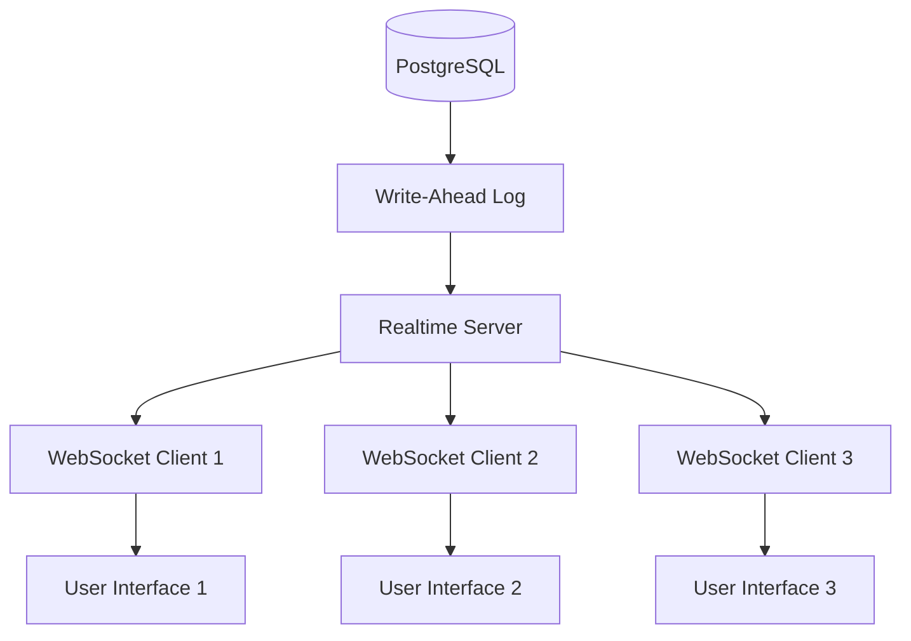

# Real-Time Synchronization

## Quick Answer
BoardOS implements real-time synchronization using Supabase's PostgreSQL replication channels, providing instant multi-user updates with optimistic UI patterns and automatic conflict resolution.

## Overview

The real-time synchronization system ensures all users see live updates to the schedule, preventing conflicts and enabling seamless collaboration. It uses PostgreSQL's built-in replication with WebSocket connections for sub-200ms latency updates.

## Architecture

### Technology Stack

```typescript
// Supabase real-time configuration
import { createClient } from '@supabase/supabase-js';
import { RealtimeChannel, RealtimePostgresChangesPayload } from '@supabase/supabase-js';

const supabase = createClient(SUPABASE_URL, SUPABASE_ANON_KEY, {
  realtime: {
    params: {
      eventsPerSecond: 10
    }
  }
});
```

### Channel Architecture



## Real-Time Subscription Setup

### Multi-Table Subscriptions

```typescript
class RealtimeManager {
  private channels: Map<string, RealtimeChannel> = new Map();
  
  setupSubscriptions() {
    // Resources channel
    const resourcesChannel = supabase
      .channel('resources-changes')
      .on(
        'postgres_changes',
        { 
          event: '*', 
          schema: 'public', 
          table: 'resources' 
        },
        this.handleResourceChange
      )
      .subscribe((status) => {
        console.log('Resources channel:', status);
      });
    
    // Jobs channel
    const jobsChannel = supabase
      .channel('jobs-changes')
      .on(
        'postgres_changes',
        { 
          event: '*', 
          schema: 'public', 
          table: 'jobs' 
        },
        this.handleJobChange
      )
      .subscribe();
    
    // Assignments channel with filter
    const assignmentsChannel = supabase
      .channel('assignments-changes')
      .on(
        'postgres_changes',
        { 
          event: '*', 
          schema: 'public', 
          table: 'assignments',
          filter: `job_id=in.(${activeJobIds.join(',')})` 
        },
        this.handleAssignmentChange
      )
      .subscribe();
    
    this.channels.set('resources', resourcesChannel);
    this.channels.set('jobs', jobsChannel);
    this.channels.set('assignments', assignmentsChannel);
  }
  
  cleanup() {
    this.channels.forEach(channel => {
      supabase.removeChannel(channel);
    });
    this.channels.clear();
  }
}
```

### Event Handlers

```typescript
interface ChangePayload<T = any> {
  eventType: 'INSERT' | 'UPDATE' | 'DELETE';
  new: T | null;
  old: T | null;
  errors: string[] | null;
}

class RealtimeEventHandler {
  handleResourceChange = (
    payload: RealtimePostgresChangesPayload<DbResource>
  ) => {
    console.log('🎯 Resource change:', payload.eventType);
    
    switch (payload.eventType) {
      case 'INSERT':
        this.handleResourceInsert(payload.new);
        break;
        
      case 'UPDATE':
        this.handleResourceUpdate(payload.new, payload.old);
        break;
        
      case 'DELETE':
        this.handleResourceDelete(payload.old);
        break;
    }
  };
  
  private handleResourceInsert(resource: DbResource) {
    // Transform and add to state
    const transformed = DatabaseService.transformDbResource(resource);
    
    setResources(prev => {
      // Avoid duplicates
      if (prev.some(r => r.id === transformed.id)) {
        return prev;
      }
      return [...prev, transformed];
    });
    
    // Show notification
    showNotification({
      type: 'info',
      message: `New resource added: ${transformed.name}`
    });
  }
  
  private handleResourceUpdate(
    newResource: DbResource,
    oldResource: DbResource
  ) {
    const transformed = DatabaseService.transformDbResource(newResource);
    
    setResources(prev => 
      prev.map(r => r.id === transformed.id ? transformed : r)
    );
    
    // Check for significant changes
    if (oldResource.name !== newResource.name) {
      showNotification({
        type: 'info',
        message: `Resource renamed: ${oldResource.name} → ${newResource.name}`
      });
    }
  }
  
  private handleResourceDelete(resource: DbResource) {
    setResources(prev => prev.filter(r => r.id !== resource.id));
    
    // Cascade delete related assignments
    setAssignments(prev => 
      prev.filter(a => a.resourceId !== resource.id)
    );
  }
}
```

## Optimistic Updates Pattern

### Implementation Strategy

```typescript
class OptimisticUpdateManager {
  private pendingUpdates = new Map<string, PendingUpdate>();
  
  async performOptimisticUpdate<T>(
    optimisticUpdate: () => T,
    databaseOperation: () => Promise<T>,
    rollback: (error: Error) => void
  ): Promise<T> {
    const updateId = generateUpdateId();
    
    // 1. Apply optimistic update immediately
    const optimisticResult = optimisticUpdate();
    
    this.pendingUpdates.set(updateId, {
      timestamp: Date.now(),
      rollback
    });
    
    try {
      // 2. Perform actual database operation
      const realResult = await databaseOperation();
      
      // 3. Remove from pending
      this.pendingUpdates.delete(updateId);
      
      return realResult;
    } catch (error) {
      // 4. Rollback on failure
      rollback(error as Error);
      this.pendingUpdates.delete(updateId);
      throw error;
    }
  }
}
```

### Practical Example

```typescript
const AssignmentManager = () => {
  const [assignments, setAssignments] = useState<Assignment[]>([]);
  
  const assignResourceOptimistically = async (
    resourceId: string,
    jobId: string
  ) => {
    const tempId = `temp-${Date.now()}`;
    
    await optimisticManager.performOptimisticUpdate(
      // Optimistic update
      () => {
        const tempAssignment = {
          id: tempId,
          resourceId,
          jobId,
          row: 'Equipment',
          _isOptimistic: true
        };
        
        setAssignments(prev => [...prev, tempAssignment]);
        return tempAssignment;
      },
      
      // Database operation
      async () => {
        const realAssignment = await DatabaseService.assignResource(
          resourceId,
          jobId,
          'Equipment'
        );
        
        // Replace temp with real
        setAssignments(prev => 
          prev.map(a => a.id === tempId ? realAssignment : a)
        );
        
        return realAssignment;
      },
      
      // Rollback
      (error) => {
        setAssignments(prev => prev.filter(a => a.id !== tempId));
        showError(`Failed to assign resource: ${error.message}`);
      }
    );
  };
};
```

## Conflict Resolution

### Last-Write-Wins Strategy

```typescript
class ConflictResolver {
  resolveConflict<T extends { updated_at: string }>(
    local: T,
    remote: T
  ): T {
    // Simple last-write-wins
    const localTime = new Date(local.updated_at).getTime();
    const remoteTime = new Date(remote.updated_at).getTime();
    
    return remoteTime > localTime ? remote : local;
  }
}
```

### Operational Transform

```typescript
class OperationalTransform {
  transformAssignmentMove(
    localOp: MoveOperation,
    remoteOp: MoveOperation
  ): MoveOperation {
    // Both trying to move same resource
    if (localOp.resourceId === remoteOp.resourceId) {
      // Remote wins, transform local to no-op
      if (remoteOp.timestamp < localOp.timestamp) {
        return {
          ...localOp,
          type: 'no-op',
          reason: 'Superseded by remote operation'
        };
      }
    }
    
    // Independent operations
    return localOp;
  }
}
```

### Merge Strategies

```typescript
class MergeStrategy {
  mergeAssignmentChanges(
    local: Assignment[],
    remote: Assignment[],
    base: Assignment[]
  ): Assignment[] {
    const merged = new Map<string, Assignment>();
    
    // Start with base
    base.forEach(a => merged.set(a.id, a));
    
    // Apply local changes
    local.forEach(a => {
      if (!base.find(b => b.id === a.id)) {
        // Local addition
        merged.set(a.id, { ...a, _source: 'local' });
      } else {
        // Local modification
        merged.set(a.id, a);
      }
    });
    
    // Apply remote changes
    remote.forEach(a => {
      const existing = merged.get(a.id);
      if (!existing || existing._source !== 'local') {
        // Remote wins for non-local changes
        merged.set(a.id, a);
      } else {
        // Conflict - need resolution
        const resolved = this.resolveConflict(existing, a);
        merged.set(a.id, resolved);
      }
    });
    
    return Array.from(merged.values());
  }
}
```

## Connection Management

### Reconnection Strategy

```typescript
class ConnectionManager {
  private reconnectAttempts = 0;
  private maxReconnectAttempts = 5;
  private reconnectDelay = 1000;
  
  async handleDisconnection() {
    console.warn('🔌 WebSocket disconnected');
    
    // Show user notification
    showConnectionStatus('disconnected');
    
    // Attempt reconnection with exponential backoff
    while (this.reconnectAttempts < this.maxReconnectAttempts) {
      await this.delay(this.reconnectDelay * Math.pow(2, this.reconnectAttempts));
      
      try {
        await this.reconnect();
        console.log('✅ Reconnected successfully');
        showConnectionStatus('connected');
        
        // Resync data
        await this.resyncData();
        
        this.reconnectAttempts = 0;
        return;
      } catch (error) {
        this.reconnectAttempts++;
        console.error(`Reconnection attempt ${this.reconnectAttempts} failed`);
      }
    }
    
    // Max attempts reached
    showConnectionStatus('failed');
    this.enterOfflineMode();
  }
  
  private async resyncData() {
    // Get latest data after reconnection
    const { resources, jobs, assignments } = 
      await DatabaseService.getAllScheduleData();
    
    // Merge with local changes
    this.mergeLocalChanges(resources, jobs, assignments);
  }
}
```

### Offline Mode

```typescript
class OfflineManager {
  private offlineQueue: OfflineOperation[] = [];
  
  enterOfflineMode() {
    console.log('📴 Entering offline mode');
    
    // Store operations locally
    this.interceptOperations();
    
    // Show offline indicator
    showOfflineIndicator(true);
  }
  
  private interceptOperations() {
    // Override database operations
    window.DatabaseService = new Proxy(DatabaseService, {
      get: (target, prop) => {
        if (typeof target[prop] === 'function') {
          return (...args: any[]) => {
            // Queue operation
            this.offlineQueue.push({
              method: prop as string,
              args,
              timestamp: Date.now()
            });
            
            // Return optimistic result
            return this.generateOptimisticResult(prop as string, args);
          };
        }
        return target[prop];
      }
    });
  }
  
  async syncOfflineOperations() {
    console.log(`📤 Syncing ${this.offlineQueue.length} offline operations`);
    
    for (const operation of this.offlineQueue) {
      try {
        await DatabaseService[operation.method](...operation.args);
      } catch (error) {
        console.error('Failed to sync operation:', operation, error);
        // Handle sync failure
      }
    }
    
    this.offlineQueue = [];
  }
}
```

## Performance Optimizations

### Subscription Filtering

```typescript
class SubscriptionOptimizer {
  optimizeSubscriptions(activeView: ViewType) {
    // Subscribe only to relevant data
    switch (activeView) {
      case 'day':
        return this.subscribeToDayView(new Date());
        
      case 'week':
        return this.subscribeToWeekView(new Date());
        
      case 'month':
        return this.subscribeToMonthView(new Date());
    }
  }
  
  private subscribeToDayView(date: Date) {
    const dateStr = date.toISOString().split('T')[0];
    
    return supabase
      .channel('day-view-changes')
      .on(
        'postgres_changes',
        {
          event: '*',
          schema: 'public',
          table: 'assignments',
          filter: `job_id=in.(
            SELECT id FROM jobs WHERE schedule_date='${dateStr}'
          )`
        },
        this.handleChange
      )
      .subscribe();
  }
}
```

### Debouncing Updates

```typescript
class UpdateDebouncer {
  private updateQueue = new Map<string, any>();
  private flushTimer: NodeJS.Timeout | null = null;
  
  queueUpdate(key: string, data: any) {
    this.updateQueue.set(key, data);
    
    if (this.flushTimer) {
      clearTimeout(this.flushTimer);
    }
    
    this.flushTimer = setTimeout(() => {
      this.flushUpdates();
    }, 100); // 100ms debounce
  }
  
  private flushUpdates() {
    const updates = Array.from(this.updateQueue.entries());
    this.updateQueue.clear();
    
    // Batch update state
    setState(prev => {
      let newState = { ...prev };
      
      updates.forEach(([key, data]) => {
        newState[key] = data;
      });
      
      return newState;
    });
  }
}
```

### Selective Rerendering

```typescript
const SelectiveUpdateComponent = () => {
  const assignments = useAssignments();
  const [visibleJobIds, setVisibleJobIds] = useState<string[]>([]);
  
  // Only rerender if visible assignments change
  const visibleAssignments = useMemo(
    () => assignments.filter(a => visibleJobIds.includes(a.jobId)),
    [assignments, visibleJobIds]
  );
  
  // Subscribe only to visible jobs
  useEffect(() => {
    const channel = supabase
      .channel('visible-jobs')
      .on(
        'postgres_changes',
        {
          event: '*',
          schema: 'public',
          table: 'assignments',
          filter: `job_id=in.(${visibleJobIds.join(',')})`
        },
        handleUpdate
      )
      .subscribe();
    
    return () => {
      supabase.removeChannel(channel);
    };
  }, [visibleJobIds]);
};
```

## Monitoring and Debugging

### Real-Time Metrics

```typescript
class RealtimeMetrics {
  private metrics = {
    messagesReceived: 0,
    averageLatency: 0,
    connectionUptime: 0,
    reconnections: 0
  };
  
  trackMessage(message: any) {
    this.metrics.messagesReceived++;
    
    // Calculate latency
    if (message.timestamp) {
      const latency = Date.now() - message.timestamp;
      this.metrics.averageLatency = 
        (this.metrics.averageLatency + latency) / 2;
    }
  }
  
  getMetrics() {
    return {
      ...this.metrics,
      connectionStatus: this.getConnectionStatus(),
      queuedUpdates: this.getQueuedUpdates()
    };
  }
}
```

### Debug Panel

```typescript
const RealtimeDebugPanel: React.FC = () => {
  const [events, setEvents] = useState<DebugEvent[]>([]);
  const [metrics, setMetrics] = useState<Metrics>();
  
  useEffect(() => {
    // Intercept all real-time events
    const originalHandler = window.handleRealtimeEvent;
    window.handleRealtimeEvent = (event) => {
      setEvents(prev => [...prev.slice(-99), {
        timestamp: Date.now(),
        type: event.eventType,
        table: event.table,
        data: event
      }]);
      
      originalHandler(event);
    };
  }, []);
  
  return (
    <div className="realtime-debug-panel">
      <h3>Real-Time Events</h3>
      <div className="event-stream">
        {events.map(event => (
          <div key={event.timestamp} className="event-item">
            <span className="timestamp">
              {new Date(event.timestamp).toLocaleTimeString()}
            </span>
            <span className={`event-type ${event.type}`}>
              {event.type}
            </span>
            <span className="table">{event.table}</span>
          </div>
        ))}
      </div>
      
      <div className="metrics">
        <div>Messages: {metrics?.messagesReceived}</div>
        <div>Avg Latency: {metrics?.averageLatency}ms</div>
        <div>Status: {metrics?.connectionStatus}</div>
      </div>
    </div>
  );
};
```

## Testing Real-Time Features

### Mock Real-Time Events

```typescript
class RealtimeMockProvider {
  simulateResourceUpdate(resource: Resource) {
    const event = {
      eventType: 'UPDATE',
      new: resource,
      old: { ...resource, name: 'Old Name' },
      table: 'resources'
    };
    
    // Trigger handler directly
    this.handlers.get('resources')?.(event);
  }
  
  simulateNetworkLatency(ms: number) {
    const original = this.emit;
    this.emit = async (...args) => {
      await new Promise(resolve => setTimeout(resolve, ms));
      return original.apply(this, args);
    };
  }
  
  simulateDisconnection() {
    this.connected = false;
    this.handlers.get('connection')?.(
      { type: 'disconnected' }
    );
  }
}
```

The real-time synchronization system ensures BoardOS provides a seamless multi-user experience with instant updates, robust conflict resolution, and reliable offline support.