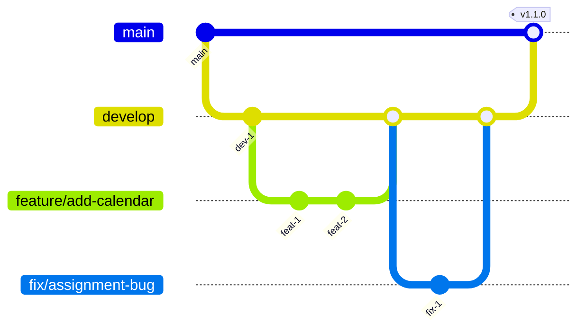

# Development Workflow Guide

## Quick Answer
BoardOS follows a feature branch workflow with pull requests, code reviews, automated testing, and continuous deployment. Developers work on feature branches, submit PRs for review, and merge to main after approval and passing tests.

## Git Workflow

### Branch Strategy



### Branch Naming Conventions

| Type | Pattern | Example |
|------|---------|---------|
| Feature | `feature/[ticket]-description` | `feature/BOARD-123-add-calendar-view` |
| Bug Fix | `fix/[ticket]-description` | `fix/BOARD-456-assignment-validation` |
| Hotfix | `hotfix/[ticket]-description` | `hotfix/BOARD-789-critical-error` |
| Release | `release/version` | `release/1.2.0` |
| Chore | `chore/description` | `chore/update-dependencies` |

### Commit Message Format

Follow Conventional Commits specification:

```bash
<type>(<scope>): <subject>

<body>

<footer>
```

#### Types
- `feat`: New feature
- `fix`: Bug fix
- `docs`: Documentation changes
- `style`: Code style changes (formatting, etc)
- `refactor`: Code refactoring
- `test`: Test additions or fixes
- `chore`: Maintenance tasks
- `perf`: Performance improvements

#### Examples
```bash
feat(scheduler): add multi-day job support

- Implement calendar view for multi-day scheduling
- Add date range picker component
- Update database schema for schedule_date field

Closes #123

---

fix(drag-drop): prevent double assignment on fast clicks

Debounce the drop handler to prevent duplicate assignments
when users click rapidly.

Fixes #456

---

docs(api): update hook documentation

- Add usage examples for useMagnet hook
- Document return types
- Add performance considerations
```

## Development Process

### 1. Starting New Work

```bash
# 1. Sync with latest main
git checkout main
git pull origin main

# 2. Create feature branch
git checkout -b feature/BOARD-123-new-feature

# 3. Install dependencies if needed
npm ci

# 4. Start development server
npm run dev
```

### 2. Development Guidelines

#### Code Style
```typescript
// ✅ Good: Clear, typed, documented
/**
 * Validates if equipment has required operator
 * @param equipment - Equipment resource to validate
 * @param assignments - Current job assignments
 * @returns Validation result with error message if invalid
 */
export function validateEquipmentOperator(
  equipment: Resource,
  assignments: Assignment[]
): ValidationResult {
  if (!EQUIPMENT_REQUIRING_OPERATOR.includes(equipment.type)) {
    return { valid: true };
  }
  
  const hasOperator = assignments.some(
    assignment => assignment.attachedTo === equipment.id &&
                  assignment.resourceType === 'operator'
  );
  
  return {
    valid: hasOperator,
    error: hasOperator ? undefined : `${equipment.name} requires an operator`,
  };
}

// ❌ Bad: Unclear, untyped, no docs
export function check(e, a) {
  if (!needsOp(e.type)) return { valid: true };
  const op = a.find(x => x.attachedTo === e.id && x.type === 'operator');
  return { valid: !!op, error: op ? null : 'needs operator' };
}
```

#### Component Structure
```typescript
// ✅ Good: Typed props, clear structure
interface ResourceCardProps {
  resource: Resource;
  isAssigned?: boolean;
  onDragStart?: (resource: Resource) => void;
  onDragEnd?: () => void;
}

export const ResourceCard: React.FC<ResourceCardProps> = ({
  resource,
  isAssigned = false,
  onDragStart,
  onDragEnd,
}) => {
  // Hooks at top
  const { startDrag, endDrag } = useDrag();
  const [isHovered, setIsHovered] = useState(false);
  
  // Handlers
  const handleDragStart = useCallback(() => {
    startDrag(resource);
    onDragStart?.(resource);
  }, [resource, startDrag, onDragStart]);
  
  // Render
  return (
    <div
      className={cn(
        'resource-card',
        isAssigned && 'opacity-50',
        isHovered && 'shadow-lg'
      )}
      draggable={!isAssigned}
      onDragStart={handleDragStart}
      onDragEnd={onDragEnd}
      onMouseEnter={() => setIsHovered(true)}
      onMouseLeave={() => setIsHovered(false)}
    >
      {/* Component content */}
    </div>
  );
};
```

### 3. Testing Your Changes

```bash
# Run unit tests
npm test

# Run specific test file
npm test ResourceCard.test

# Run tests in watch mode during development
npm run test:watch

# Check test coverage
npm run test:coverage

# Run E2E tests
npm run test:e2e

# Run all checks before committing
npm run precommit
```

### 4. Pre-commit Checklist

```bash
#!/bin/bash
# .husky/pre-commit

# Run linter
npm run lint

# Run type checking
npm run type-check

# Run tests
npm run test:run

# Check for console.logs
grep -r "console.log" src/ && echo "Remove console.logs" && exit 1

# Check bundle size
npm run build -- --analyze
```

### 5. Creating Pull Request

#### PR Template
```markdown
## Description
Brief description of changes

## Type of Change
- [ ] Bug fix (non-breaking change fixing an issue)
- [ ] New feature (non-breaking change adding functionality)
- [ ] Breaking change (fix or feature causing existing functionality to change)
- [ ] Documentation update

## Changes Made
- List specific changes
- Include any architectural decisions
- Note any new dependencies

## Testing
- [ ] Unit tests pass
- [ ] E2E tests pass
- [ ] Tested on mobile
- [ ] Tested on desktop
- [ ] Tested with real data

## Screenshots
If applicable, add screenshots

## Checklist
- [ ] Code follows style guidelines
- [ ] Self-review completed
- [ ] Comments added for complex code
- [ ] Documentation updated
- [ ] No new warnings
- [ ] Tests added/updated
- [ ] All tests passing
```

#### Creating the PR
```bash
# Push your branch
git push origin feature/BOARD-123-new-feature

# Create PR via GitHub CLI
gh pr create \
  --title "feat: Add calendar view for multi-day scheduling" \
  --body-file .github/pull_request_template.md \
  --base main \
  --assignee @me \
  --label "enhancement"
```

## Code Review Process

### For Authors

1. **Self-Review First**
   - Review your own diff
   - Check for debug code
   - Verify no secrets exposed
   - Ensure tests cover changes

2. **Provide Context**
   - Link related issues
   - Explain design decisions
   - Highlight areas needing attention
   - Include testing instructions

3. **Respond Promptly**
   - Address feedback within 24 hours
   - Ask for clarification if needed
   - Update PR description with changes

### For Reviewers

1. **Review Checklist**
   - [ ] Code correctness
   - [ ] Test coverage
   - [ ] Performance impact
   - [ ] Security considerations
   - [ ] Documentation updates
   - [ ] UI/UX consistency

2. **Feedback Guidelines**
   ```typescript
   // 🟢 Constructive feedback
   "Consider using useMemo here to prevent recalculation on each render:
   const expensiveValue = useMemo(() => calculateValue(data), [data]);"
   
   // 🔴 Unconstructive feedback
   "This is inefficient."
   ```

3. **Approval Criteria**
   - Functionality works as expected
   - Code quality meets standards
   - Tests are comprehensive
   - No security issues
   - Documentation is updated

## CI/CD Pipeline

### GitHub Actions Workflow

```yaml
# .github/workflows/ci.yml
name: CI/CD Pipeline

on:
  push:
    branches: [main, develop]
  pull_request:
    branches: [main]

jobs:
  lint:
    runs-on: ubuntu-latest
    steps:
      - uses: actions/checkout@v3
      - uses: actions/setup-node@v3
        with:
          node-version: 18
          cache: 'npm'
      
      - run: npm ci
      - run: npm run lint
      - run: npm run type-check

  test:
    runs-on: ubuntu-latest
    steps:
      - uses: actions/checkout@v3
      - uses: actions/setup-node@v3
        with:
          node-version: 18
          cache: 'npm'
      
      - run: npm ci
      - run: npm run test:coverage
      
      - uses: codecov/codecov-action@v3
        with:
          file: ./coverage/coverage-final.json

  e2e:
    runs-on: ubuntu-latest
    steps:
      - uses: actions/checkout@v3
      - uses: actions/setup-node@v3
      
      - run: npm ci
      - run: npx playwright install --with-deps
      - run: npm run test:e2e
      
      - uses: actions/upload-artifact@v3
        if: failure()
        with:
          name: playwright-report
          path: playwright-report/

  build:
    runs-on: ubuntu-latest
    needs: [lint, test]
    steps:
      - uses: actions/checkout@v3
      - uses: actions/setup-node@v3
      
      - run: npm ci
      - run: npm run build
      
      - uses: actions/upload-artifact@v3
        with:
          name: build-output
          path: dist/

  deploy:
    runs-on: ubuntu-latest
    needs: [build, e2e]
    if: github.ref == 'refs/heads/main'
    steps:
      - uses: actions/checkout@v3
      
      - uses: actions/download-artifact@v3
        with:
          name: build-output
          path: dist/
      
      - name: Deploy to Production
        env:
          VERCEL_TOKEN: ${{ secrets.VERCEL_TOKEN }}
        run: |
          npx vercel --prod --token=$VERCEL_TOKEN
```

### Deployment Process

#### Staging Deployment
```bash
# Automatic deployment on develop branch
git checkout develop
git merge feature/your-feature
git push origin develop
# Deploys to staging.boardos.com
```

#### Production Deployment
```bash
# Create release branch
git checkout -b release/1.2.0 develop

# Update version
npm version minor

# Create PR to main
gh pr create --base main --title "Release v1.2.0"

# After approval and merge
git checkout main
git pull origin main
git tag -a v1.2.0 -m "Release version 1.2.0"
git push origin v1.2.0

# Automatic deployment triggered
```

## Release Process

### 1. Version Bumping
```bash
# Patch release (1.0.0 -> 1.0.1)
npm version patch

# Minor release (1.0.0 -> 1.1.0)
npm version minor

# Major release (1.0.0 -> 2.0.0)
npm version major
```

### 2. Changelog Generation
```bash
# Generate changelog from commits
npx conventional-changelog -p angular -i CHANGELOG.md -s

# Or use release-it
npx release-it
```

### 3. Release Notes Template
```markdown
# Release v1.2.0

## 🚀 Features
- Add calendar view for multi-day scheduling (#123)
- Implement resource availability tracking (#124)

## 🐛 Bug Fixes
- Fix double assignment on fast clicks (#456)
- Resolve timezone issues in time slots (#457)

## 🔧 Improvements
- Optimize database queries for better performance
- Improve mobile drag-and-drop experience

## 📦 Dependencies
- Update React to 18.2.0
- Update Supabase client to 2.39.0

## 💔 Breaking Changes
None

## 📝 Migration Guide
Run the following migration:
\`\`\`sql
ALTER TABLE jobs ADD COLUMN schedule_date DATE DEFAULT CURRENT_DATE;
\`\`\`
```

## Development Tools

### Recommended VS Code Extensions
```json
// .vscode/extensions.json
{
  "recommendations": [
    "dbaeumer.vscode-eslint",
    "esbenp.prettier-vscode",
    "bradlc.vscode-tailwindcss",
    "dsznajder.es7-react-js-snippets",
    "formulahendry.auto-rename-tag",
    "streetsidesoftware.code-spell-checker",
    "github.copilot",
    "eamodio.gitlens",
    "vitest.explorer"
  ]
}
```

### VS Code Settings
```json
// .vscode/settings.json
{
  "editor.formatOnSave": true,
  "editor.defaultFormatter": "esbenp.prettier-vscode",
  "editor.codeActionsOnSave": {
    "source.fixAll.eslint": true,
    "source.organizeImports": true
  },
  "typescript.updateImportsOnFileMove.enabled": "always",
  "typescript.preferences.importModuleSpecifier": "shortest",
  "tailwindCSS.experimental.classRegex": [
    ["cn\\(([^)]*)\\)", "[\"'`]([^\"'`]*).*?[\"'`]"]
  ]
}
```

## Contributing Guidelines

### Getting Started
1. Fork the repository
2. Clone your fork
3. Add upstream remote: `git remote add upstream https://github.com/original/boardos.git`
4. Create feature branch
5. Make changes
6. Submit PR

### Contribution Standards
- Write clean, readable code
- Add tests for new features
- Update documentation
- Follow existing patterns
- Keep PRs focused and small
- Respond to feedback promptly

### Code of Conduct
- Be respectful and inclusive
- Welcome newcomers
- Provide constructive feedback
- Focus on what's best for the project
- Accept feedback gracefully

## Troubleshooting

### Common Issues

#### Merge Conflicts
```bash
# Update your branch with latest main
git checkout main
git pull origin main
git checkout your-branch
git rebase main

# Resolve conflicts
git status
# Edit conflicted files
git add .
git rebase --continue
```

#### Failed Tests
```bash
# Run tests locally first
npm test

# Debug specific test
npm test -- --inspect ResourceCard.test.tsx

# Update snapshots if needed
npm test -- -u
```

#### Build Failures
```bash
# Clear cache and rebuild
rm -rf node_modules dist
npm ci
npm run build

# Check for type errors
npm run type-check
```

## Best Practices

1. **Keep PRs Small** - Easier to review and less risky
2. **Write Tests First** - TDD helps design better APIs
3. **Document as You Go** - Don't leave it for later
4. **Refactor Regularly** - Keep code clean
5. **Communicate Early** - Discuss big changes before implementing
6. **Use Draft PRs** - Get early feedback on approach
7. **Automate Everything** - Linting, testing, deployment
8. **Monitor Performance** - Profile before optimizing
9. **Review Dependencies** - Keep them minimal and updated
10. **Learn from Mistakes** - Post-mortems for issues

The development workflow ensures consistent, high-quality code through collaboration, automation, and best practices.