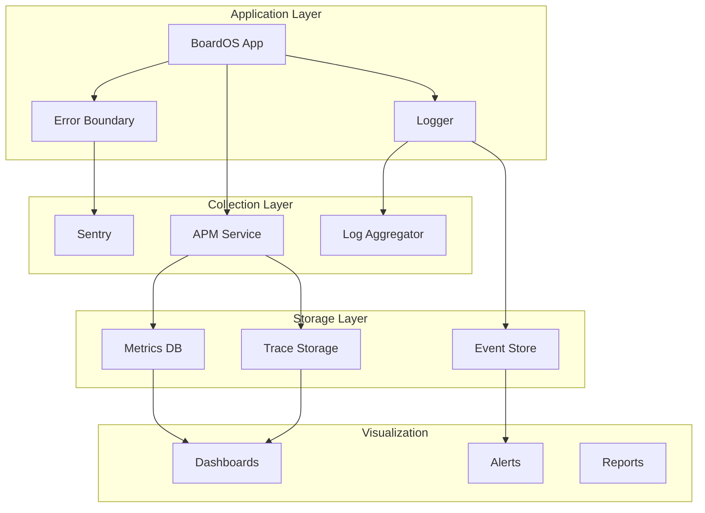

# Monitoring & Observability Setup

## Quick Answer
Monitor BoardOS using Sentry for error tracking, application performance monitoring (APM) for metrics, Supabase Dashboard for database insights, and custom logging for business events. Set up alerts for critical issues and maintain dashboards for operational visibility.

## Monitoring Stack Overview



## Error Tracking with Sentry

### Installation & Setup

```bash
npm install @sentry/react @sentry/tracing
```

```typescript
// src/monitoring/sentry.ts
import * as Sentry from '@sentry/react';
import { BrowserTracing } from '@sentry/tracing';

export function initSentry() {
  Sentry.init({
    dsn: import.meta.env.VITE_SENTRY_DSN,
    environment: import.meta.env.VITE_ENVIRONMENT || 'development',
    
    integrations: [
      new BrowserTracing({
        // Set sampling rate for performance monitoring
        tracingOrigins: ['localhost', 'boardos.com', /^\//],
        routingInstrumentation: Sentry.reactRouterV6Instrumentation(
          React.useEffect,
          useLocation,
          useNavigationType,
          createRoutesFromChildren,
          matchRoutes
        ),
      }),
      new Sentry.Replay({
        maskAllText: true,
        blockAllMedia: true,
      }),
    ],
    
    // Performance Monitoring
    tracesSampleRate: import.meta.env.PROD ? 0.1 : 1.0,
    
    // Session Replay
    replaysSessionSampleRate: 0.1,
    replaysOnErrorSampleRate: 1.0,
    
    // Release Tracking
    release: import.meta.env.VITE_APP_VERSION,
    
    // User Context
    beforeSend(event, hint) {
      // Add user context
      if (event.user) {
        event.user = {
          ...event.user,
          id: getUserId(),
          email: getUserEmail(),
        };
      }
      
      // Filter sensitive data
      if (event.request?.cookies) {
        delete event.request.cookies;
      }
      
      return event;
    },
    
    // Ignore certain errors
    ignoreErrors: [
      'ResizeObserver loop limit exceeded',
      'Non-Error promise rejection captured',
      /extension\//i,
      /^chrome:\/\//i,
    ],
  });
}
```

### Error Boundaries

```typescript
// src/components/ErrorBoundary.tsx
import { ErrorBoundary } from '@sentry/react';

export const AppErrorBoundary: React.FC<{ children: ReactNode }> = ({ children }) => {
  return (
    <ErrorBoundary
      fallback={({ error, resetError }) => (
        <ErrorFallback error={error} resetError={resetError} />
      )}
      showDialog
      onError={(error, errorInfo) => {
        console.error('Error caught by boundary:', error, errorInfo);
        
        // Log to custom analytics
        trackError({
          error: error.message,
          stack: error.stack,
          componentStack: errorInfo.componentStack,
        });
      }}
    >
      {children}
    </ErrorBoundary>
  );
};
```

### Custom Error Tracking

```typescript
// src/monitoring/errorTracking.ts
export class ErrorTracker {
  static captureException(
    error: Error,
    context?: Record<string, any>
  ): void {
    // Send to Sentry
    Sentry.captureException(error, {
      contexts: {
        custom: context,
      },
      tags: {
        component: context?.component,
        action: context?.action,
      },
    });
    
    // Log locally in development
    if (import.meta.env.DEV) {
      console.error('Error captured:', error, context);
    }
  }
  
  static captureMessage(
    message: string,
    level: Sentry.SeverityLevel = 'info'
  ): void {
    Sentry.captureMessage(message, level);
  }
  
  static setUserContext(user: User): void {
    Sentry.setUser({
      id: user.id,
      email: user.email,
      username: user.name,
    });
  }
  
  static addBreadcrumb(breadcrumb: Sentry.Breadcrumb): void {
    Sentry.addBreadcrumb(breadcrumb);
  }
}
```

## Application Performance Monitoring

### Web Vitals Tracking

```typescript
// src/monitoring/webVitals.ts
import { getCLS, getFID, getFCP, getLCP, getTTFB } from 'web-vitals';

interface Metric {
  name: string;
  value: number;
  rating: 'good' | 'needs-improvement' | 'poor';
  delta: number;
}

export function initWebVitals() {
  const sendToAnalytics = (metric: Metric) => {
    // Send to monitoring service
    fetch('/api/metrics', {
      method: 'POST',
      headers: { 'Content-Type': 'application/json' },
      body: JSON.stringify({
        metric: metric.name,
        value: metric.value,
        rating: metric.rating,
        timestamp: Date.now(),
        page: window.location.pathname,
      }),
    });
    
    // Log to console in development
    if (import.meta.env.DEV) {
      console.log(`${metric.name}:`, metric.value, metric.rating);
    }
    
    // Send to Sentry
    Sentry.addBreadcrumb({
      category: 'web-vitals',
      message: `${metric.name}: ${metric.value}`,
      level: metric.rating === 'poor' ? 'warning' : 'info',
      data: metric,
    });
  };
  
  getCLS(sendToAnalytics);
  getFID(sendToAnalytics);
  getFCP(sendToAnalytics);
  getLCP(sendToAnalytics);
  getTTFB(sendToAnalytics);
}
```

### Custom Performance Metrics

```typescript
// src/monitoring/performance.ts
export class PerformanceMonitor {
  private static marks = new Map<string, number>();
  
  static startMeasure(name: string): void {
    this.marks.set(name, performance.now());
    performance.mark(`${name}-start`);
  }
  
  static endMeasure(name: string): number {
    const start = this.marks.get(name);
    if (!start) {
      console.warn(`No start mark found for ${name}`);
      return 0;
    }
    
    const end = performance.now();
    const duration = end - start;
    
    performance.mark(`${name}-end`);
    performance.measure(name, `${name}-start`, `${name}-end`);
    
    // Send to monitoring
    this.reportMetric(name, duration);
    
    this.marks.delete(name);
    return duration;
  }
  
  private static reportMetric(name: string, value: number): void {
    // Report to Sentry
    const transaction = Sentry.getCurrentHub().getScope()?.getTransaction();
    if (transaction) {
      transaction.setMeasurement(name, value, 'millisecond');
    }
    
    // Custom analytics
    if (window.analytics) {
      window.analytics.track('Performance Metric', {
        metric: name,
        value,
        unit: 'ms',
      });
    }
  }
}

// Usage
PerformanceMonitor.startMeasure('job-assignment');
// ... perform operation
PerformanceMonitor.endMeasure('job-assignment');
```

## Database Monitoring

### Supabase Metrics

```typescript
// src/monitoring/database.ts
export class DatabaseMonitor {
  static async checkHealth(): Promise<HealthStatus> {
    const checks = {
      connection: false,
      realtime: false,
      performance: false,
    };
    
    try {
      // Check basic connection
      const start = performance.now();
      const { error } = await supabase
        .from('jobs')
        .select('count')
        .limit(1)
        .single();
      
      const latency = performance.now() - start;
      checks.connection = !error;
      checks.performance = latency < 1000; // Under 1 second
      
      // Check realtime
      const channel = supabase.channel('health-check');
      checks.realtime = channel.state === 'joined';
      
      // Report metrics
      this.reportMetrics({
        dbLatency: latency,
        connectionStatus: checks.connection,
        realtimeStatus: checks.realtime,
      });
      
      return {
        healthy: Object.values(checks).every(v => v),
        checks,
        latency,
      };
    } catch (error) {
      ErrorTracker.captureException(error as Error, {
        component: 'DatabaseMonitor',
      });
      return { healthy: false, checks };
    }
  }
  
  static monitorQueryPerformance<T>(
    queryName: string,
    queryFn: () => Promise<T>
  ): Promise<T> {
    return Sentry.startSpan(
      {
        name: `db.query.${queryName}`,
        op: 'db.query',
      },
      async () => {
        const start = performance.now();
        
        try {
          const result = await queryFn();
          const duration = performance.now() - start;
          
          // Log slow queries
          if (duration > 2000) {
            console.warn(`Slow query detected: ${queryName} took ${duration}ms`);
            Sentry.captureMessage(
              `Slow query: ${queryName}`,
              'warning'
            );
          }
          
          return result;
        } catch (error) {
          ErrorTracker.captureException(error as Error, {
            query: queryName,
          });
          throw error;
        }
      }
    );
  }
}
```

### Query Performance Tracking

```sql
-- Monitor slow queries in Supabase
CREATE OR REPLACE FUNCTION log_slow_queries()
RETURNS void AS $$
DECLARE
  query_record RECORD;
BEGIN
  FOR query_record IN
    SELECT 
      query,
      calls,
      total_time,
      mean_time,
      max_time
    FROM pg_stat_statements
    WHERE mean_time > 100 -- queries averaging over 100ms
    ORDER BY mean_time DESC
    LIMIT 10
  LOOP
    INSERT INTO monitoring.slow_queries (
      query_text,
      avg_duration,
      max_duration,
      execution_count,
      logged_at
    ) VALUES (
      query_record.query,
      query_record.mean_time,
      query_record.max_time,
      query_record.calls,
      NOW()
    );
  END LOOP;
END;
$$ LANGUAGE plpgsql;

-- Schedule monitoring
SELECT cron.schedule(
  'monitor-slow-queries',
  '*/5 * * * *', -- Every 5 minutes
  'SELECT log_slow_queries();'
);
```

## Business Metrics Tracking

### Custom Analytics

```typescript
// src/monitoring/analytics.ts
export class Analytics {
  static trackEvent(
    event: string,
    properties?: Record<string, any>
  ): void {
    // Google Analytics
    if (window.gtag) {
      window.gtag('event', event, properties);
    }
    
    // PostHog
    if (window.posthog) {
      window.posthog.capture(event, properties);
    }
    
    // Custom backend
    fetch('/api/analytics/events', {
      method: 'POST',
      headers: { 'Content-Type': 'application/json' },
      body: JSON.stringify({
        event,
        properties,
        timestamp: Date.now(),
        sessionId: getSessionId(),
      }),
    });
  }
  
  static trackBusinessMetric(metric: BusinessMetric): void {
    this.trackEvent('business_metric', {
      metric_name: metric.name,
      value: metric.value,
      category: metric.category,
    });
  }
}

// Business metric definitions
interface BusinessMetric {
  name: string;
  value: number;
  category: 'utilization' | 'efficiency' | 'performance';
}

// Track key business metrics
export function trackSchedulerMetrics(state: SchedulerState) {
  // Resource utilization
  const utilization = 
    state.assignments.length / state.resources.length;
  
  Analytics.trackBusinessMetric({
    name: 'resource_utilization',
    value: utilization * 100,
    category: 'utilization',
  });
  
  // Job completion rate
  const completionRate = 
    state.jobs.filter(j => j.finalized).length / state.jobs.length;
  
  Analytics.trackBusinessMetric({
    name: 'job_completion_rate',
    value: completionRate * 100,
    category: 'efficiency',
  });
  
  // Average assignments per job
  const avgAssignments = 
    state.assignments.length / state.jobs.length;
  
  Analytics.trackBusinessMetric({
    name: 'avg_assignments_per_job',
    value: avgAssignments,
    category: 'performance',
  });
}
```

## Logging Infrastructure

### Structured Logging

```typescript
// src/monitoring/logger.ts
enum LogLevel {
  DEBUG = 0,
  INFO = 1,
  WARN = 2,
  ERROR = 3,
}

interface LogEntry {
  level: LogLevel;
  message: string;
  timestamp: string;
  context?: Record<string, any>;
  error?: Error;
}

export class Logger {
  private static logLevel: LogLevel = 
    import.meta.env.DEV ? LogLevel.DEBUG : LogLevel.INFO;
  
  private static format(entry: LogEntry): string {
    return JSON.stringify({
      ...entry,
      timestamp: new Date().toISOString(),
      environment: import.meta.env.VITE_ENVIRONMENT,
      version: import.meta.env.VITE_APP_VERSION,
    });
  }
  
  private static send(entry: LogEntry): void {
    // Console output
    const consoleMethod = 
      entry.level === LogLevel.ERROR ? 'error' :
      entry.level === LogLevel.WARN ? 'warn' :
      'log';
    
    console[consoleMethod](entry.message, entry.context);
    
    // Send to logging service in production
    if (import.meta.env.PROD) {
      fetch('/api/logs', {
        method: 'POST',
        headers: { 'Content-Type': 'application/json' },
        body: this.format(entry),
      }).catch(err => {
        console.error('Failed to send log:', err);
      });
    }
    
    // Add to Sentry breadcrumb
    Sentry.addBreadcrumb({
      message: entry.message,
      level: this.mapToSentryLevel(entry.level),
      category: 'app',
      data: entry.context,
    });
  }
  
  static debug(message: string, context?: Record<string, any>): void {
    if (this.logLevel <= LogLevel.DEBUG) {
      this.send({ level: LogLevel.DEBUG, message, context });
    }
  }
  
  static info(message: string, context?: Record<string, any>): void {
    if (this.logLevel <= LogLevel.INFO) {
      this.send({ level: LogLevel.INFO, message, context });
    }
  }
  
  static warn(message: string, context?: Record<string, any>): void {
    if (this.logLevel <= LogLevel.WARN) {
      this.send({ level: LogLevel.WARN, message, context });
    }
  }
  
  static error(
    message: string,
    error?: Error,
    context?: Record<string, any>
  ): void {
    this.send({ 
      level: LogLevel.ERROR, 
      message, 
      error, 
      context 
    });
    
    // Also capture in Sentry
    if (error) {
      ErrorTracker.captureException(error, context);
    }
  }
  
  private static mapToSentryLevel(level: LogLevel): Sentry.SeverityLevel {
    switch (level) {
      case LogLevel.DEBUG: return 'debug';
      case LogLevel.INFO: return 'info';
      case LogLevel.WARN: return 'warning';
      case LogLevel.ERROR: return 'error';
    }
  }
}
```

## Alert Configuration

### Alert Rules

```typescript
// src/monitoring/alerts.ts
interface AlertRule {
  name: string;
  condition: (metrics: Metrics) => boolean;
  severity: 'critical' | 'warning' | 'info';
  message: string;
  cooldown: number; // minutes
}

const alertRules: AlertRule[] = [
  {
    name: 'high-error-rate',
    condition: (m) => m.errorRate > 5, // 5% error rate
    severity: 'critical',
    message: 'Error rate exceeds 5%',
    cooldown: 15,
  },
  {
    name: 'slow-response',
    condition: (m) => m.p95ResponseTime > 3000, // 3 seconds
    severity: 'warning',
    message: 'P95 response time exceeds 3 seconds',
    cooldown: 30,
  },
  {
    name: 'database-connection-failure',
    condition: (m) => !m.databaseHealthy,
    severity: 'critical',
    message: 'Database connection failed',
    cooldown: 5,
  },
  {
    name: 'low-resource-utilization',
    condition: (m) => m.resourceUtilization < 20,
    severity: 'info',
    message: 'Resource utilization below 20%',
    cooldown: 60,
  },
];

export class AlertManager {
  private static lastAlertTime = new Map<string, number>();
  
  static checkAlerts(metrics: Metrics): void {
    const now = Date.now();
    
    for (const rule of alertRules) {
      if (rule.condition(metrics)) {
        const lastAlert = this.lastAlertTime.get(rule.name) || 0;
        const cooldownMs = rule.cooldown * 60 * 1000;
        
        if (now - lastAlert > cooldownMs) {
          this.sendAlert(rule, metrics);
          this.lastAlertTime.set(rule.name, now);
        }
      }
    }
  }
  
  private static sendAlert(
    rule: AlertRule,
    metrics: Metrics
  ): void {
    // Log alert
    Logger.warn(`Alert triggered: ${rule.name}`, {
      severity: rule.severity,
      metrics,
    });
    
    // Send to Sentry
    Sentry.captureMessage(rule.message, rule.severity);
    
    // Send notification
    if (rule.severity === 'critical') {
      this.sendCriticalAlert(rule, metrics);
    }
  }
  
  private static async sendCriticalAlert(
    rule: AlertRule,
    metrics: Metrics
  ): Promise<void> {
    // Send email/SMS/Slack notification
    await fetch('/api/alerts/critical', {
      method: 'POST',
      headers: { 'Content-Type': 'application/json' },
      body: JSON.stringify({
        rule: rule.name,
        message: rule.message,
        metrics,
        timestamp: new Date().toISOString(),
      }),
    });
  }
}
```

## Dashboard Setup

### Monitoring Dashboard

```typescript
// src/components/MonitoringDashboard.tsx
export const MonitoringDashboard: React.FC = () => {
  const [metrics, setMetrics] = useState<Metrics>();
  const [health, setHealth] = useState<HealthStatus>();
  
  useEffect(() => {
    const interval = setInterval(async () => {
      // Fetch metrics
      const metricsData = await fetchMetrics();
      setMetrics(metricsData);
      
      // Check health
      const healthData = await DatabaseMonitor.checkHealth();
      setHealth(healthData);
      
      // Check alerts
      AlertManager.checkAlerts(metricsData);
    }, 30000); // Every 30 seconds
    
    return () => clearInterval(interval);
  }, []);
  
  return (
    <div className="monitoring-dashboard">
      <HealthIndicator status={health} />
      <MetricsGrid metrics={metrics} />
      <ErrorRateChart />
      <ResponseTimeChart />
      <ResourceUtilizationChart />
      <RecentErrorsList />
      <SlowQueriesList />
    </div>
  );
};
```

### Health Check Endpoint

```typescript
// src/api/health.ts
export async function healthCheck(): Promise<Response> {
  const checks = {
    app: true,
    database: false,
    realtime: false,
    storage: false,
  };
  
  try {
    // Check database
    const dbHealth = await DatabaseMonitor.checkHealth();
    checks.database = dbHealth.healthy;
    
    // Check realtime
    const channel = supabase.channel('health');
    checks.realtime = channel.state === 'joined';
    channel.unsubscribe();
    
    // Check storage
    const { error } = await supabase.storage
      .from('attachments')
      .list('', { limit: 1 });
    checks.storage = !error;
    
    const allHealthy = Object.values(checks).every(v => v);
    
    return new Response(
      JSON.stringify({
        status: allHealthy ? 'healthy' : 'degraded',
        checks,
        timestamp: new Date().toISOString(),
        version: import.meta.env.VITE_APP_VERSION,
      }),
      {
        status: allHealthy ? 200 : 503,
        headers: { 'Content-Type': 'application/json' },
      }
    );
  } catch (error) {
    return new Response(
      JSON.stringify({
        status: 'unhealthy',
        error: error.message,
        checks,
      }),
      {
        status: 503,
        headers: { 'Content-Type': 'application/json' },
      }
    );
  }
}
```

## Monitoring Checklist

### Setup Checklist
- [ ] Configure Sentry project and DSN
- [ ] Set up error boundaries
- [ ] Implement structured logging
- [ ] Configure web vitals tracking
- [ ] Set up custom metrics
- [ ] Create health check endpoint
- [ ] Configure alert rules
- [ ] Set up monitoring dashboard
- [ ] Test error reporting
- [ ] Verify metrics collection

### Metrics to Monitor
- [ ] Error rate and types
- [ ] Response times (P50, P95, P99)
- [ ] Database query performance
- [ ] Real-time connection stability
- [ ] Resource utilization rates
- [ ] Job completion rates
- [ ] User session duration
- [ ] Feature usage statistics
- [ ] Browser/device distribution
- [ ] Geographic distribution

### Alert Thresholds
- [ ] Error rate > 5% (critical)
- [ ] P95 response time > 3s (warning)
- [ ] Database connection failure (critical)
- [ ] Memory usage > 90% (warning)
- [ ] Failed deployments (critical)
- [ ] Disk space < 10% (warning)
- [ ] SSL certificate expiry < 30 days (warning)

## Best Practices

1. **Use structured logging** - JSON format for easy parsing
2. **Add context to errors** - Include user, action, and state
3. **Monitor business metrics** - Not just technical metrics
4. **Set up dashboards** - Visual monitoring for quick insights
5. **Configure alerts wisely** - Avoid alert fatigue
6. **Track deployments** - Correlate issues with releases
7. **Monitor user journeys** - Not just individual actions
8. **Regular review** - Adjust thresholds based on patterns
9. **Document incidents** - Learn from issues
10. **Test monitoring** - Ensure alerts work as expected

Comprehensive monitoring ensures BoardOS reliability, performance, and user satisfaction through proactive issue detection and resolution.